# OCP On Nutanix (IPI)


## 參考資料

https://docs.openshift.com/container-platform/4.12/installing/installing_nutanix/preparing-to-install-on-nutanix.html

https://www.nutanix.dev/2022/08/16/red-hat-openshift-ipi-on-nutanix-cloud-platform/

https://itnext.io/guide-install-openshift-4-12-using-ipi-on-nutanix-ce-2-0-3bee9422de5

憑證
https://sdwh.dev/posts/2021/03/IIS-Create-Certificate-Signed-Requests-With-MMC/

https://www.firewall.cx/microsoft-knowledgebase/windows-server-2016/1260-how-to-enaable-webserver-certificate-template.htmls


## Requrements

| Component     | Required version  |
| ------------- | ----------------- |
| Nutanix AOS   | 5.20.4+ or 6.5.1+ |
| Prism Central | 2022.4+           |

Network: 要使用Nutanix IPAM、設定DNS、NTP

DNS: 

| API VIP         | `api.<cluster_name>.<base_domain>.`      |
| --------------- | ---------------------------------------- |
| **Ingress VIP** | ***.apps.<cluster_name>.<base_domain>.** |
| domain          | ken.lab                                  |

## 架構

| 名稱        | IP            | Account             |
| ----------- | ------------- | ------------------- |
| Windows AD  | 172.16.90.204 | administrator       |
| Bootsrap    | 172.16.90.203 |                     |
| Bastion     | 172.16.90.216 | ken/root - P@55w.rd |
| Master01    | 172.16.90.217 |                     |
| Master02    | 172.16.90.218 |                     |
| Master03    | 172.16.90.219 |                     |
| Worker01    | 172.16.90.220 |                     |
| Worker02    | 172.16.90.221 |                     |
| Worker03    | 172.16.90.222 |                     |
| API VIP     | 172.16.90.223 |                     |
| Ingress VIP | 172.16.90.224 |                     |

## 環境準備

1. 設定DNS -- > 要設定為apps 此處圖設定錯誤
   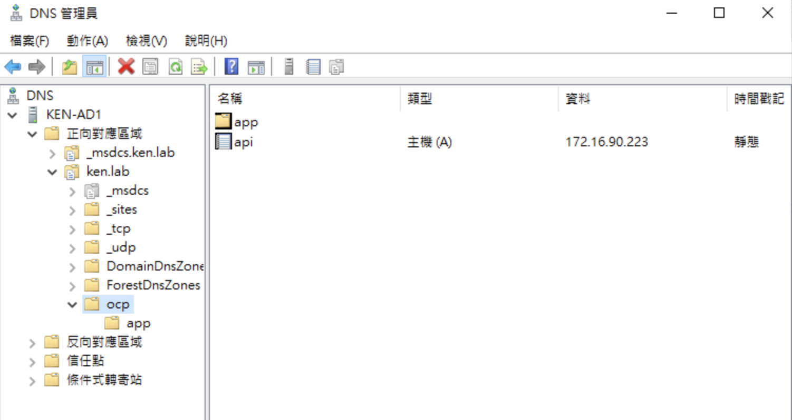

   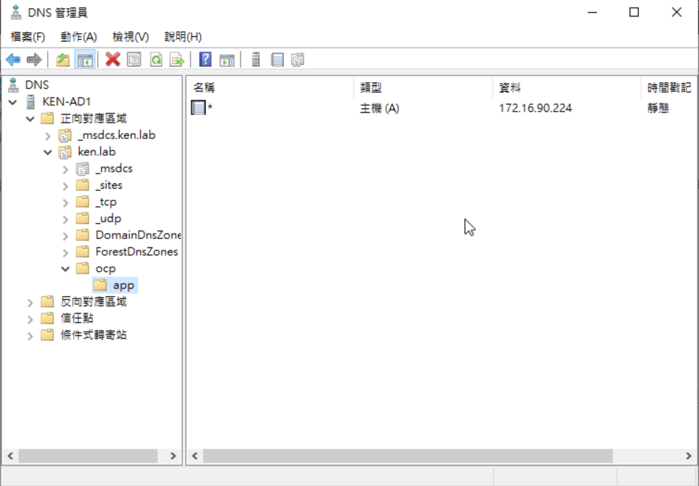

2. 設定IPAM For Master、Worker
   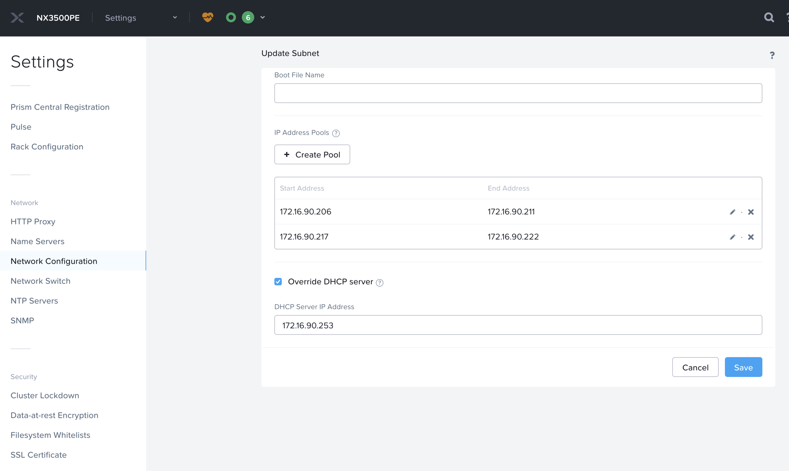

3. 安裝Bastion rhel9.0
   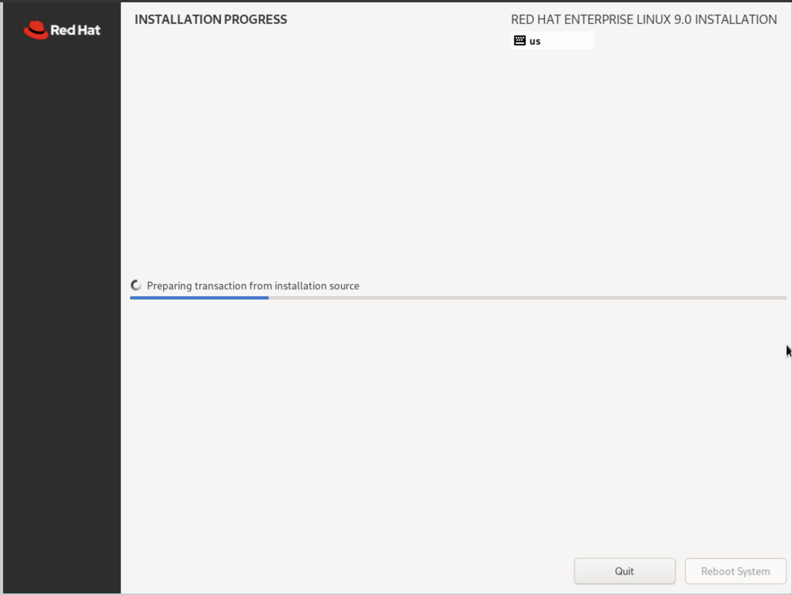

4. 123

## 安裝步驟

### CA

1. 安裝憑證授權單位
   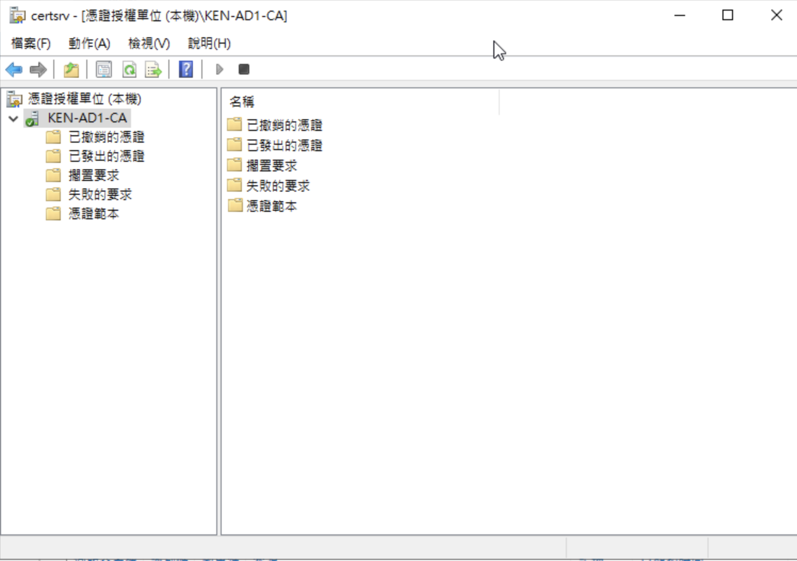

2. 新增憑證要求-- 開啟執行、輸入mmc，在個人的地方新增憑證要求

   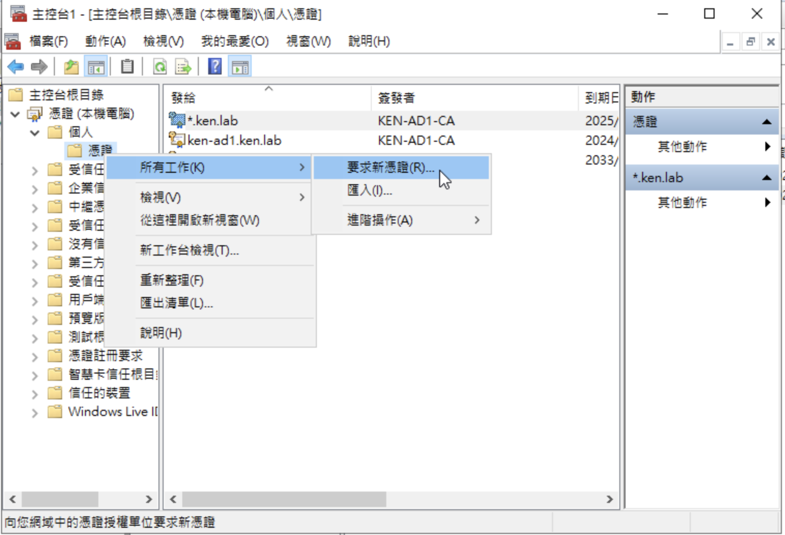

   

   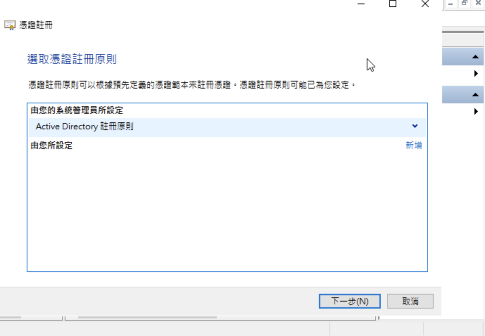

   

   選擇Web伺服器、並調整設定，此處DNS改為 nx3500pc.ken.lab 圖為錯誤的DNS

   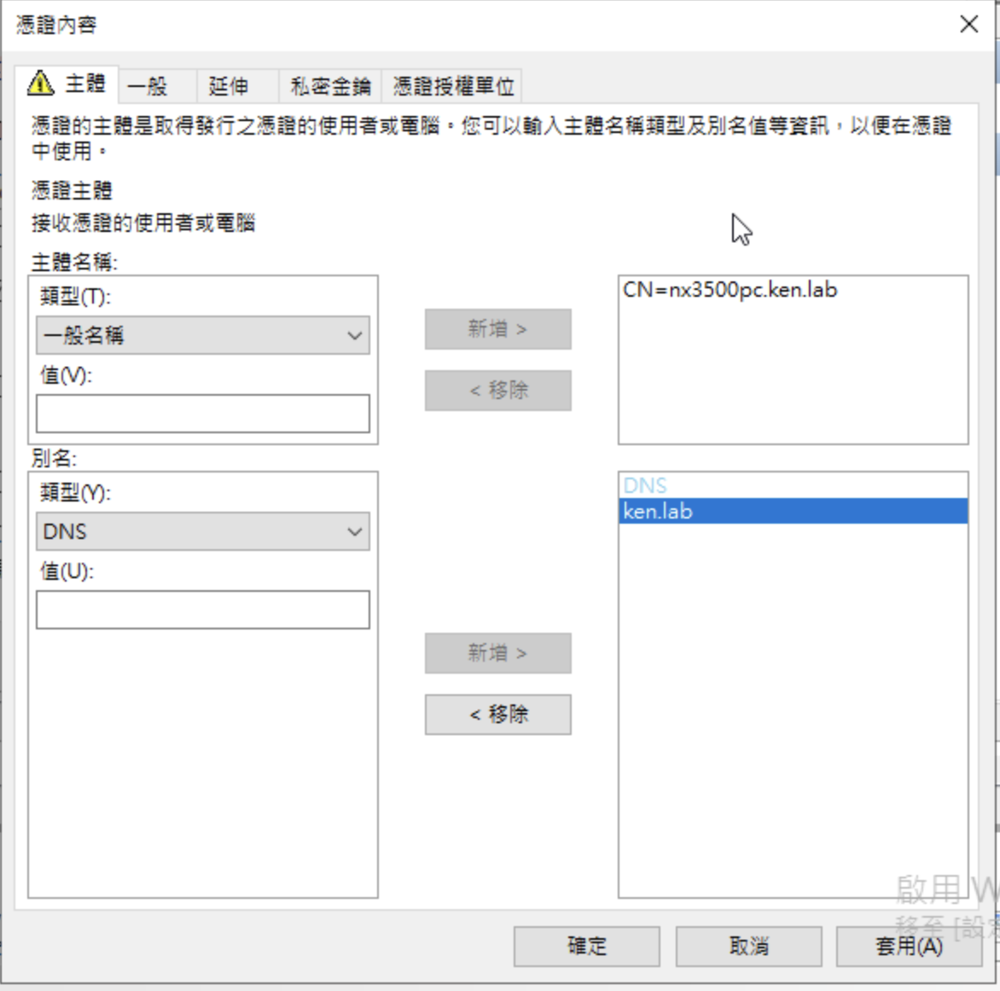

   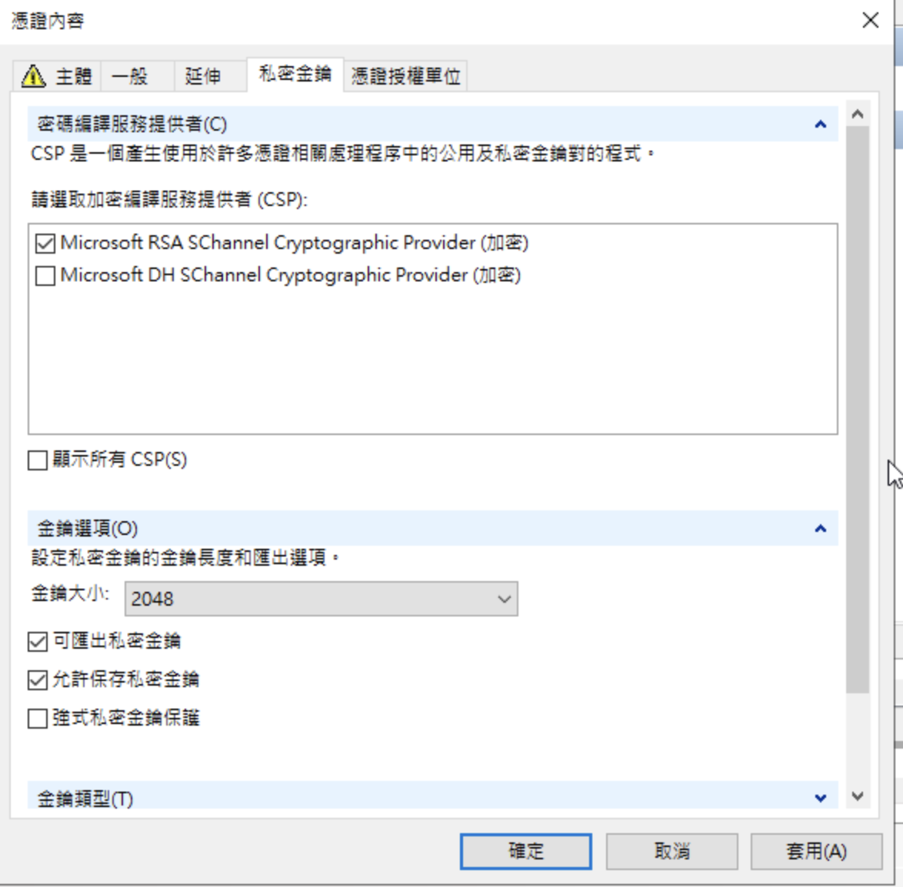

3. 確認憑證授權單位
   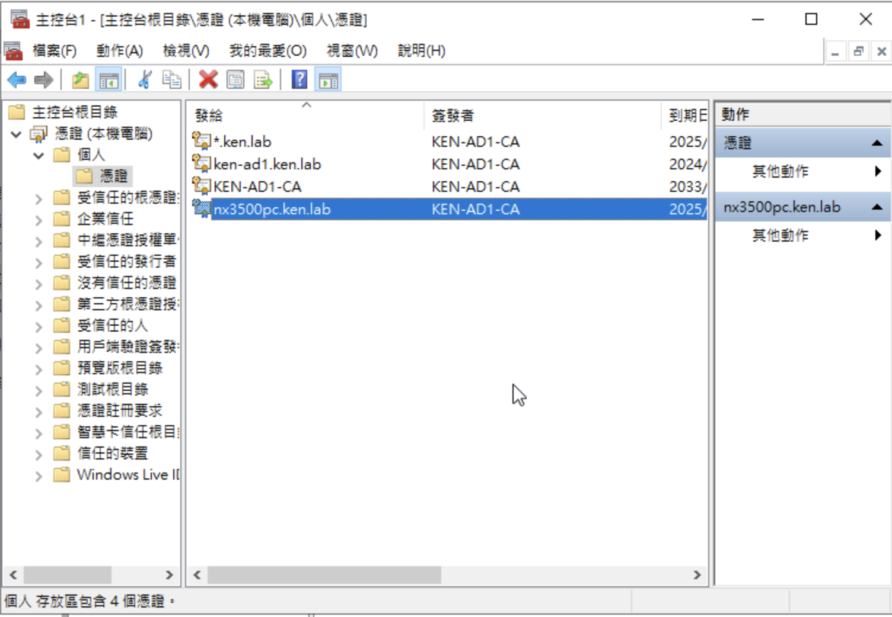

   

4. 匯出*.ken.lab憑證、根憑證、私密金鑰
   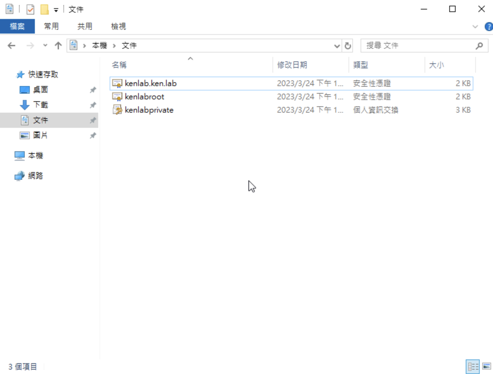

5. 匯入至PC
   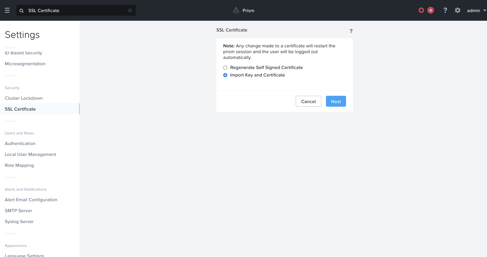

   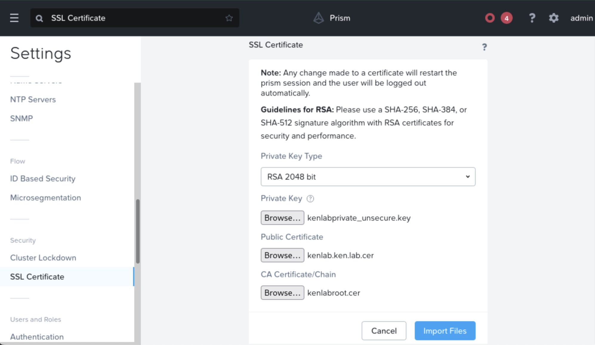

   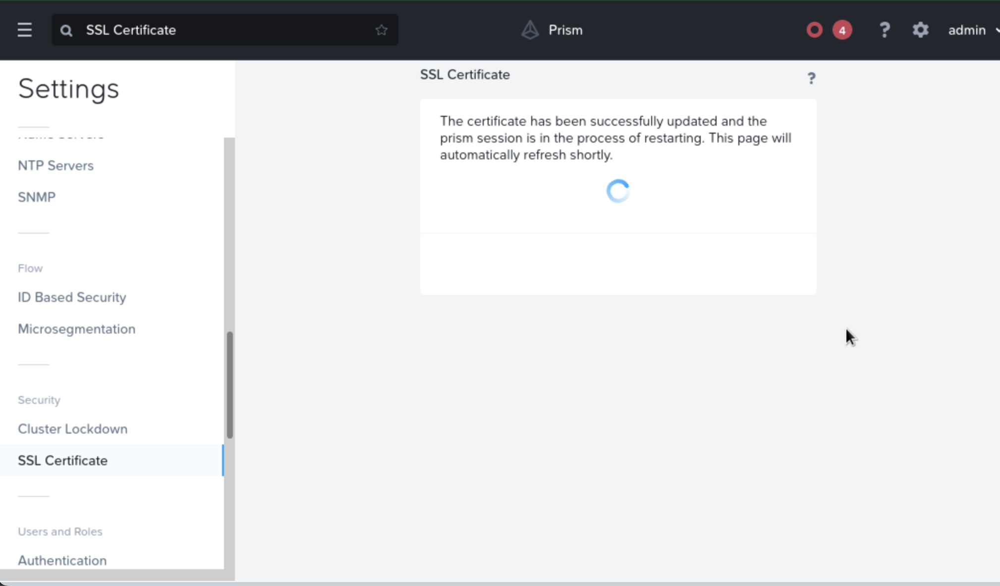

   

6. 匯入至Bastion

   ```
   wangken@wangken-MAC ~ % ssh ken@172.16.90.216
   ken@172.16.90.216's password: 
   Activate the web console with: systemctl enable --now cockpit.socket
   
   Register this system with Red Hat Insights: insights-client --register
   Create an account or view all your systems at https://red.ht/insights-dashboard
   Last login: Fri Mar 24 12:11:09 2023 from 172.16.90.97
   
   [ken@bastion ~]$ ll
   total 12
   -rwx------. 1 ken ken 1830 Mar 24 12:13 kenlab.ken.lab.cer
   -rwx------. 1 ken ken 2603 Mar 24 12:13 kenlabprivate.pfx
   -rwx------. 1 ken ken 1240 Mar 24 12:13 kenlabroot.cer
   
   [ken@bastion ~]$ sudo cp kenlab* /etc/pki/ca-trust/source/anchors/
   
   We trust you have received the usual lecture from the local System
   Administrator. It usually boils down to these three things:
   
       #1) Respect the privacy of others.
       #2) Think before you type.
       #3) With great power comes great responsibility.
   
   [sudo] password for ken: 
   [ken@bastion ~]$ sudo update-ca-trust extract
   
   ## 轉檔私密金鑰pfx to key
   [ken@bastion ~]$ openssl rsa -in kenlabprivate.pfx -out kenlabprivate_unsecure.pfx
   Enter pass phrase for PKCS12 import pass phrase:
   writing RSA key
   [ken@bastion ~]$ openssl rsa -in kenlabprivate_unsecure.pfx -out kenlabprivate_unsecure.key
   writing RSA key
   
   ## 用Firefox瀏覽器開啟PC 下載rootCA憑證並匯入
   [ken@bastion Downloads]$ openssl x509 -inform PEM -in nx3500pc-ken-lab.pem -out nx3500pc-ken-lab-CA.crt
   [ken@bastion Downloads]$ sudo cp nx3500pc-ken-lab-CA.crt /etc/pki/ca-trust/source/anchors/
   [ken@bastion Downloads]$ sudo update-ca-trust extract
   [ken@bastion Downloads]$ openssl verify nx3500pc-ken-lab-CA.crt 
   nx3500pc-ken-lab-CA.crt: OK
   ```
   
7. ccoctl 下載

   ```
   [ken@bastion ocp_install]$ RELEASE_IMAGE=$(./openshift-install version | awk '/release image/ {print $3}')
   [ken@bastion ocp_install]$ CCO_IMAGE=$(oc adm release info --image-for='cloud-credential-operator' $RELEASE_IMAGE -a ~/ocp_install/pull-secret.dms)
   [ken@bastion ocp_install]$ oc image extract $CCO_IMAGE --file="/usr/bin/ccoctl" -a ~/ocp_install/pull-secret.dms 
   [ken@bastion ocp_install]$ ll
   total 1205872
   -rw-r-----. 1 ken ken  73518152 Feb 28 10:26 ccoctl
   -rw-r-----. 1 ken ken      3883 Mar 24 16:14 install-config.yaml
   -rwxr-xr-x. 2 ken ken 130709656 Mar  1 18:18 kubectl
   -rwxr-xr-x. 2 ken ken 130709656 Mar  1 18:18 oc
   -rw-r--r--. 1 ken ken  55161420 Mar 24 13:50 openshift-client-linux.tar.gz
   -rwxr-xr-x. 1 ken ken 494526464 Mar  3 06:48 openshift-install
   -rw-r--r--. 1 ken ken 350165021 Mar 24 13:50 openshift-install-linux.tar.gz
   -rw-r--r--. 1 ken ken      2779 Mar 24 13:50 pull-secret.dms
   -rw-r--r--. 1 ken ken       706 Mar  3 06:48 README.md
   [ken@bastion ocp_install]$ chmod 775 ccoctl
   [ken@bastion ocp_install]$ sudo cp ccoctl /usr/local/bin/
   [sudo] password for ken: 
   [ken@bastion ocp_install]$ ccoctl --help
   OpenShift credentials provisioning tool
   
   Usage:
     ccoctl [command]
   Available Commands:
     alibabacloud Manage credentials objects for alibaba cloud
     aws          Manage credentials objects for AWS cloud
     completion   Generate the autocompletion script for the specified shell
     gcp          Manage credentials objects for Google cloud
     help         Help about any command
     ibmcloud     Manage credentials objects for IBM Cloud
     nutanix      Manage credentials objects for Nutanix
   
   Flags:
     -h, --help   help for ccoctl
   
   Use "ccoctl [command] --help" for more information about a command.
   ```

8. 123

9. 123

10. 123

### Bastion

1. 下載openshift-install、oc client、pull secret

   ```
   [ken@bastion ocp_install]$ ll
   total 395836
   -rw-r--r--. 1 ken ken  55161420 Mar 24 13:50 openshift-client-linux.tar.gz
   -rw-r--r--. 1 ken ken 350165021 Mar 24 13:50 openshift-install-linux.tar.gz
   -rw-r--r--. 1 ken ken      2779 Mar 24 13:50 pull-secret.dms
   ```

2. 安裝oc client

   ```
   [ken@bastion ocp_install]$ tar xvf openshift-client-linux.tar.gz 
   README.md
   oc
   kubectl
   [ken@bastion ocp_install]$ echo $PATH
   /home/ken/.local/bin:/home/ken/bin:/usr/local/bin:/usr/bin:/usr/local/sbin:/usr/sbin
   [ken@bastion ocp_install]$ sudo cp oc kubectl /usr/local/bin/
   [sudo] password for ken: 
   
   [ken@bastion ocp_install]$ oc --help
   OpenShift Client
   
   This client helps you develop, build, deploy, and run your applications on any
   OpenShift or Kubernetes cluster. It also includes the administrative
   commands for managing a cluster under the 'adm' subcommand.
   ```

3. 解壓縮openshit-installer

   ```
   [ken@bastion ocp_install]$ tar xvf openshift-install-linux.tar.gz 
   README.md
   openshift-install
   ```

4. 建立ssh key

   ```
   [ken@bastion ocp_install]$ ssh-keygen -t ed25519 -N '' -f ~/.ssh/ken
   Generating public/private ed25519 key pair.
   Created directory '/home/ken/.ssh'.
   Your identification has been saved in /home/ken/.ssh/ken
   Your public key has been saved in /home/ken/.ssh/ken.pub
   The key fingerprint is:
   SHA256:FUMbO4r0VAROq5TnE76zmx3RJRqhuiwYSVib1NElBHY ken@bastion.ocp.ken.lab
   The key's randomart image is:
   +--[ED25519 256]--+
   |  o.+=E.++O      |
   | + +...= + B     |
   |. +   + B * . .  |
   | . . o X + = o   |
   |  o   + S o .    |
   |   o . . o .     |
   |  . . o o .      |
   |     .   = .     |
   |        +..      |
   +----[SHA256]-----+
   [ken@bastion ocp_install]$ ll ~/.ssh/
   total 8
   -rw-------. 1 ken ken 419 Mar 24 13:54 ken
   -rw-r--r--. 1 ken ken 105 Mar 24 13:54 ken.pub
   [ken@bastion ocp_install]$ cat ~/.ssh/ken.pub 
   ssh-ed25519 AAAAC3NzaC1lZDI1NTE5AAAAIB6G2bHLlXOThGUs2NX2UWR4ObK9t14G2Tiw+nXRVV6W ken@bastion.ocp.ken.lab
   ```

#### 產生 install-config.yaml

1. 執行openshift-installer

   ```
   ./openshift-install create install-config --dir /home/ken/ocp_install/
   
   [ken@bastion ocp_install]$ ./openshift-install create install-config --dir /home/ken/ocp_install/
   ? SSH Public Key /home/ken/.ssh/ken.pub
   ? Platform nutanix
   ? Prism Central nx3500pc.ken.lab
   ? Port 9440
   ? Username admin
   ? Password [? for help] **************
   INFO Connecting to Prism Central nx3500pc.ken.lab 
   ? Prism Element NX3500PE
   ? Subnet Netfos_90_Access_IPAM
   X Sorry, your reply was invalid: IP expected to be in one of the machine networks: 10.0.0.0/16
   ? Virtual IP Address for API 10.0.0.1
   ? Virtual IP Address for Ingress 10.0.0.2
   ? Base Domain ken.lab
   ? Cluster Name ocp
   ? Pull Secret [? for help] *****************************************************************************************************************************************************************************************************
   INFO Install-Config created in: /home/ken/ocp_install 
   [ken@bastion ocp_install]$ ll
   total 1134076
   -rw-r-----. 1 ken ken      3873 Mar 24 15:49 install-config.yaml
   -rwxr-xr-x. 2 ken ken 130709656 Mar  1 18:18 kubectl
   -rwxr-xr-x. 2 ken ken 130709656 Mar  1 18:18 oc
   -rw-r--r--. 1 ken ken  55161420 Mar 24 13:50 openshift-client-linux.tar.gz
   -rwxr-xr-x. 1 ken ken 494526464 Mar  3 06:48 openshift-install
   -rw-r--r--. 1 ken ken 350165021 Mar 24 13:50 openshift-install-linux.tar.gz
   -rw-r--r--. 1 ken ken      2779 Mar 24 13:50 pull-secret.dms
   -rw-r--r--. 1 ken ken       706 Mar  3 06:48 README.md
   ```

2. 此版本目前有bug 需要先使用10.0.0.0/16 的ip設定API、Ingress IP
   產生install-config.yaml後再修改

   ```
   [ken@bastion ocp_install]$ vim install-config.yaml 
   
   
   platform:
     nutanix:
       apiVIPs:
       - 172.16.90.223
       ingressVIPs:
       - 172.16.90.224
   
   ```

3. Configuring IAM for Nutanix

   ```
   [ken@bastion ocp_install]$ vim credentials.yaml
   
   credentials:
   - type: basic_auth
     data:
       prismCentral:
         username: admin
         password: Nutanix/Lab123
       prismElements:
       - name: NX3500PE
         username: admin
         password: Nutanix/Lab123
   ```

4. CredentialsRequest

   ```
   [ken@bastion ocp_install]$ ./openshift-install version
   ./openshift-install 4.12.7
   built from commit 7c2530226516a12c37f10bc14e070f66c0f27930
   release image quay.io/openshift-release-dev/ocp-release@sha256:bd712a7aa5c1763870e721f92e19104c3c1b930d1a7d550a122c0ebbe2513aee
   release architecture amd64
   
   [ken@bastion ocp_install]$ RELEASE_IMAGE=$(./openshift-install version | awk '/release image/ {print $3}')
   [ken@bastion ocp_install]$  
   Extracted release payload created at 2023-03-08T13:56:42Z
   
   [ken@bastion ocp_install]$ cd credrequests/
   [ken@bastion credrequests]$ ll
   total 4
   -rw-r--r--. 1 ken ken 482 Mar 24 16:40 0000_30_machine-api-operator_00_credentials-request.yaml
   [ken@bastion credrequests]$ cat 0000_30_machine-api-operator_00_credentials-request.yaml 
   ---
   apiVersion: cloudcredential.openshift.io/v1
   kind: CredentialsRequest
   metadata:
     annotations:
       include.release.openshift.io/self-managed-high-availability: "true"
     labels:
       controller-tools.k8s.io: "1.0"
     name: openshift-machine-api-nutanix
     namespace: openshift-cloud-credential-operator
   spec:
     providerSpec:
       apiVersion: cloudcredential.openshift.io/v1
       kind: NutanixProviderSpec
     secretRef:
       name: nutanix-credentials
       namespace: openshift-machine-api
   ```

5. 建立CCO Secret

   ```
   [ken@bastion ocp_install]$ ccoctl nutanix create-shared-secrets --credentials-requests-dir=/home/ken/ocp_install/credrequests --output-dir=. --credentials-source-filepath=/home/ken/ocp_install/credentials.yaml
   2023/03/24 16:43:44 Saved credentials configuration to: manifests/openshift-machine-api-nutanix-credentials-credentials.yaml
   
   [ken@bastion ocp_install]$ ll
   total 1205876
   -rwxrwxr-x. 1 ken ken  73518152 Feb 28 10:26 ccoctl
   -rw-r--r--. 1 ken ken       204 Mar 24 16:27 credentials.yaml
   drwxr-xr-x. 2 ken ken        70 Mar 24 16:40 credrequests
   -rw-r-----. 1 ken ken      3907 Mar 24 16:22 install-config.yaml
   -rwxr-xr-x. 2 ken ken 130709656 Mar  1 18:18 kubectl
   drwx------. 2 ken ken        72 Mar 24 16:43 manifests
   -rwxr-xr-x. 2 ken ken 130709656 Mar  1 18:18 oc
   -rw-r--r--. 1 ken ken  55161420 Mar 24 13:50 openshift-client-linux.tar.gz
   -rwxr-xr-x. 1 ken ken 494526464 Mar  3 06:48 openshift-install
   -rw-r--r--. 1 ken ken 350165021 Mar 24 13:50 openshift-install-linux.tar.gz
   -rw-r--r--. 1 ken ken      2779 Mar 24 13:50 pull-secret.dms
   -rw-r--r--. 1 ken ken       706 Mar  3 06:48 README.md
   
   [ken@bastion ocp_install]$ tree manifests/
   manifests/
   └── openshift-machine-api-nutanix-credentials-credentials.yaml
   
   0 directories, 1 file
   [ken@bastion ocp_install]$ cat manifests/openshift-machine-api-nutanix-credentials-credentials.yaml 
   apiVersion: v1
   kind: Secret
   metadata:
     name: nutanix-credentials
     namespace: openshift-machine-api
   type: Opaque
   data:
     credentials: W3sidHlwZSI6ImJhc2ljX2F1dGgiLCJkYXRhIjp7InByaXNtQ2VudHJhbCI6eyJ1c2VybmFtZSI6ImFkbWluIiwicGFzc3dvcmQiOiJOdXRhbml4L0xhYjEyMyJ9LCJwcmlzbUVsZW1lbnRzIjpbeyJ1c2VybmFtZSI6ImFkbWluIiwicGFzc3dvcmQiOiJOdXRhbml4L0xhYjEyMyIsIm5hbWUiOiJOWDM1MDBQRSJ9XX19XQ==[ken@bastion ocp_install]$ 
   ```

6. 修改install-config.yaml credentialsMode成Manual、MachineNetwork修改

   ```
   [ken@bastion ocp_install]$ cat install-config.yaml 
   additionalTrustBundlePolicy: Proxyonly
   apiVersion: v1
   baseDomain: ken.lab
   compute:
   - architecture: amd64
     hyperthreading: Enabled
     name: worker
     platform: {}
     replicas: 3
   controlPlane:
     architecture: amd64
     hyperthreading: Enabled
     name: master
     platform: {}
     replicas: 3
   credentialsMode: Manual
   metadata:
     creationTimestamp: null
     name: ocp
   networking:
     clusterNetwork:
     - cidr: 10.128.0.0/14
       hostPrefix: 23
     machineNetwork:
     - cidr: 172.16.90.0/24
     networkType: OVNKubernetes
     serviceNetwork:
     - 172.30.0.0/16
   platform:
     nutanix:
       apiVIPs:
       - 172.16.90.223
       ingressVIPs:
       - 172.16.90.224
       prismCentral:
         endpoint:
           address: nx3500pc.ken.lab
           port: 9440
         password: Nutanix/Lab123
         username: admin
       prismElements:
       - endpoint:
           address: 172.16.90.71
           port: 9440
         uuid: 0005f5e3-b012-833d-30e7-002590c84b9a
       subnetUUIDs:
       - 91bec494-3a7a-482a-b00b-bceaadf47489
   publish: External
   pullSecret: '{"auths":{"cloud.openshift.com":{"auth":"b3BlbnNoaWZ0LXJlbGVhc2UtZGV2K29jbV9hY2Nlc3NfN2FiMGVmMjg5NTc5NGQ2ODgzOGYwZTYzNGI4OWRkNjI6Mk5CREU5T1NZTEdHWUtLOEFGOUlDTTcyMzZVSUVMSzUxTUpGOFcyWEdPSk9BU1haTDc1S0hQMUZHWURLNzgwSw==","email":"kenwang906@gmail.com"},"quay.io":{"auth":"b3BlbnNoaWZ0LXJlbGVhc2UtZGV2K29jbV9hY2Nlc3NfN2FiMGVmMjg5NTc5NGQ2ODgzOGYwZTYzNGI4OWRkNjI6Mk5CREU5T1NZTEdHWUtLOEFGOUlDTTcyMzZVSUVMSzUxTUpGOFcyWEdPSk9BU1haTDc1S0hQMUZHWURLNzgwSw==","email":"kenwang906@gmail.com"},"registry.connect.redhat.com":{"auth":"fHVoYy1wb29sLWU2MjU1MTBkLTE1ZjAtNGE5NS1iNGJjLTk2MzU5NTgzYmNmZTpleUpoYkdjaU9pSlNVelV4TWlKOS5leUp6ZFdJaU9pSTFOR0l3T1RVNE5HUTJZMkUwTUdJME9HRXlNVFExTWpRM1lqZGhNVGt6WlNKOS5vUm5uQ0tVQVZ2T3hyYk5la0JaTlNRdUhzTXVZV3BhM2tGdTNJQ2tzQ3NGSjhsaDZVUGdRb1NnM0hXT3IzcHAyVy15MVNBN29BNnRlbTB0ekVfenZwTTJCeWxsUkNnVEh1RlNZSE1DamxXRTZ2NUhDRjB2S3dtUFZ1ODNuRzRaakFwZzJRSk9kYkg4XzFaT0xDNlBqbkFGSi1uSDVLZFBxU3JNd3g1b19yYnZPQVRSRXktX2lQVW9zMXc0bTRzNUNncm9FNkFwNk5qY3FTanlGdjJOcDA5QVQ4aVA3Xzk4d2FfMW1WUEI4QkItcVJBVi1xclFYRGY0cEtwMzlYNExoNzgyalZYQ1V1SnZJUjN1SUdVUm1qWGVaYTEzSG5VcHcxdFc4aXZuUjVaV19iZndjZmoxR3FVVGo1a0stczJmeTdlNHFvSzdJTklGajJOZkM2dGhnZU5ST2FlR3E1dDZhUUV3dnV4UDV2dFViOTNEdElfc3JUOG5vcUszTXI2NkRLMUNTUTlianZMUkxNMVZOY2xCdUp2RS1yZGxkTDAyQ0ZkWTZJcmZ1VUpzN1VvcVE3WWdISWFVSFk3SDlGVE9qOWdsaWlSUTZ3MlhJNDM0dHNxTDJHLU85Ty1LTGVFUnF4ZjROY0o3NkFzaGE3aTNORW4yWHZaV0JmdXNmWEsyQUVscUt2N1FSQXhWVTFNQXN1TDdmTVNVaktrWkZFUUR2ZEZ2Tktoem1iVUVRTjl0dDMycFNvYVpCWnltRVB0WVl2ZzNPdG9pLW55Zmh1X1pzVEJzQkxRTGVZNTRJc2dZWk4zV0ZtV0hSSlBZOG53dm84bjZEN1lrT2ZqNzFhMEF5b3Btc2ZuLWp0Uk5KU3g3RGlCSlV3SkRnbFJYXzI1Y3lXR0JsZjFvODE1cw==","email":"kenwang906@gmail.com"},"registry.redhat.io":{"auth":"fHVoYy1wb29sLWU2MjU1MTBkLTE1ZjAtNGE5NS1iNGJjLTk2MzU5NTgzYmNmZTpleUpoYkdjaU9pSlNVelV4TWlKOS5leUp6ZFdJaU9pSTFOR0l3T1RVNE5HUTJZMkUwTUdJME9HRXlNVFExTWpRM1lqZGhNVGt6WlNKOS5vUm5uQ0tVQVZ2T3hyYk5la0JaTlNRdUhzTXVZV3BhM2tGdTNJQ2tzQ3NGSjhsaDZVUGdRb1NnM0hXT3IzcHAyVy15MVNBN29BNnRlbTB0ekVfenZwTTJCeWxsUkNnVEh1RlNZSE1DamxXRTZ2NUhDRjB2S3dtUFZ1ODNuRzRaakFwZzJRSk9kYkg4XzFaT0xDNlBqbkFGSi1uSDVLZFBxU3JNd3g1b19yYnZPQVRSRXktX2lQVW9zMXc0bTRzNUNncm9FNkFwNk5qY3FTanlGdjJOcDA5QVQ4aVA3Xzk4d2FfMW1WUEI4QkItcVJBVi1xclFYRGY0cEtwMzlYNExoNzgyalZYQ1V1SnZJUjN1SUdVUm1qWGVaYTEzSG5VcHcxdFc4aXZuUjVaV19iZndjZmoxR3FVVGo1a0stczJmeTdlNHFvSzdJTklGajJOZkM2dGhnZU5ST2FlR3E1dDZhUUV3dnV4UDV2dFViOTNEdElfc3JUOG5vcUszTXI2NkRLMUNTUTlianZMUkxNMVZOY2xCdUp2RS1yZGxkTDAyQ0ZkWTZJcmZ1VUpzN1VvcVE3WWdISWFVSFk3SDlGVE9qOWdsaWlSUTZ3MlhJNDM0dHNxTDJHLU85Ty1LTGVFUnF4ZjROY0o3NkFzaGE3aTNORW4yWHZaV0JmdXNmWEsyQUVscUt2N1FSQXhWVTFNQXN1TDdmTVNVaktrWkZFUUR2ZEZ2Tktoem1iVUVRTjl0dDMycFNvYVpCWnltRVB0WVl2ZzNPdG9pLW55Zmh1X1pzVEJzQkxRTGVZNTRJc2dZWk4zV0ZtV0hSSlBZOG53dm84bjZEN1lrT2ZqNzFhMEF5b3Btc2ZuLWp0Uk5KU3g3RGlCSlV3SkRnbFJYXzI1Y3lXR0JsZjFvODE1cw==","email":"kenwang906@gmail.com"}}}'
   sshKey: |
     ssh-ed25519 AAAAC3NzaC1lZDI1NTE5AAAAIB6G2bHLlXOThGUs2NX2UWR4ObK9t14G2Tiw+nXRVV6W ken@bastion.ocp.ken.lab
   
   ```

7. 創建工作目錄

   ```
   [ken@bastion ocp_install]$ mkdir 412
   [ken@bastion ocp_install]$ cp install-config.yaml 412/
   [ken@bastion ocp_install]$ vim install-config.yaml 
   [ken@bastion ocp_install]$ cp install-config.yaml 412/
   [ken@bastion ocp_install]$ cp openshift-install 412/
   [ken@bastion ocp_install]$ cd 412/
   [ken@bastion 412]$ ll
   total 482940
   -rw-r-----. 1 ken ken      3886 Mar 24 16:49 install-config.yaml
   -rwxr-xr-x. 1 ken ken 494526464 Mar 24 16:49 openshift-install
   [ken@bastion 412]$ pwd
   /home/ken/ocp_install/412
   ```

8. 建立manifests

   ```
   [ken@bastion 412]$ ./openshift-install create manifests --dir /home/ken/ocp_install/412/
   INFO Consuming Install Config from target directory 
   INFO Manifests created in: /home/ken/ocp_install/412/manifests and /home/ken/ocp_install/412/openshift
   [ken@bastion ocp_install]$ cp manifests/openshift-machine-api-nutanix-credentials-credentials.yaml 412/manifests/
   
   [ken@bastion 412]$ ll
   total 482944
   drwxr-x---. 2 ken ken      4096 Mar 24 16:52 manifests
   drwxr-x---. 2 ken ken      4096 Mar 24 16:51 openshift
   -rwxr-xr-x. 1 ken ken 494526464 Mar 24 16:49 openshift-install
   [ken@bastion 412]$ tree manifests/
   manifests/
   ├── cluster-config.yaml
   ├── cluster-dns-02-config.yml
   ├── cluster-infrastructure-02-config.yml
   ├── cluster-ingress-02-config.yml
   ├── cluster-network-01-crd.yml
   ├── cluster-network-02-config.yml
   ├── cluster-proxy-01-config.yaml
   ├── cluster-scheduler-02-config.yml
   ├── cvo-overrides.yaml
   ├── kube-cloud-config.yaml
   ├── kube-system-configmap-root-ca.yaml
   ├── machine-config-server-tls-secret.yaml
   ├── openshift-config-secret-pull-secret.yaml
   └── openshift-machine-api-nutanix-credentials-credentials.yaml
   
   0 directories, 14 files
   ```

#### 創立Cluster

1. create cluster

   ```
   [ken@bastion 412]$ ./openshift-install create cluster --dir /home/ken/ocp_install/412/ --log-level=info
   INFO Consuming Common Manifests from target directory 
   INFO Consuming Worker Machines from target directory 
   INFO Consuming OpenShift Install (Manifests) from target directory 
   INFO Consuming Openshift Manifests from target directory 
   INFO Consuming Master Machines from target directory 
   INFO Creating infrastructure resources... 
   
   ```

   

2. Prism Element開始建立image
   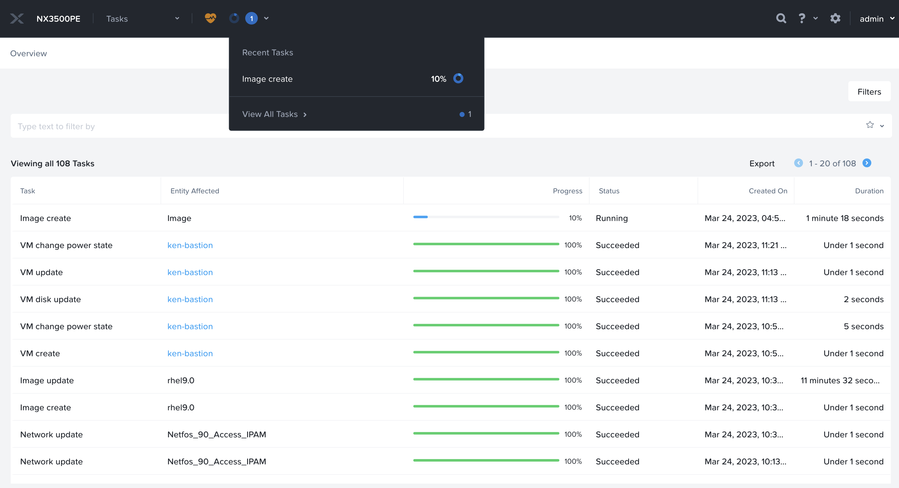

   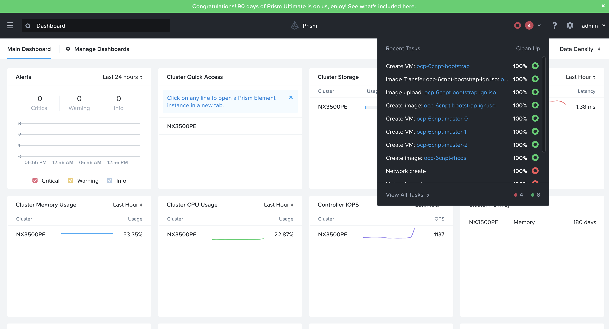

3. 登入bootstrap查看log

   ```
   [ken@bastion 412]$ ssh -i ~/.ssh/ken core@172.16.90.217
   client_global_hostkeys_private_confirm: server gave bad signature for RSA key 0: error in libcrypto
   Red Hat Enterprise Linux CoreOS 412.86.202301311551-0
     Part of OpenShift 4.12, RHCOS is a Kubernetes native operating system
     managed by the Machine Config Operator (`clusteroperator/machine-config`).
   
   WARNING: Direct SSH access to machines is not recommended; instead,
   make configuration changes via `machineconfig` objects:
     https://docs.openshift.com/container-platform/4.12/architecture/architecture-rhcos.html
   
   ---
   This is the bootstrap node; it will be destroyed when the master is fully up.
   
   The primary services are release-image.service followed by bootkube.service. To watch their status, run e.g.
   
     journalctl -b -f -u release-image.service -u bootkube.service
     
     [core@ocp-6cnpt-bootstrap ~]$ journalctl -b -f -u release-image.service -u bootkube.service
   -- Logs begin at Fri 2023-03-24 08:59:05 UTC. --
   Mar 24 09:01:51 ocp-6cnpt-bootstrap bootkube.sh[4754]: time="2023-03-24T09:01:51Z" level=info msg="Writing file: /assets/cco-bootstrap/manifests/cco-cloudcredential_v1_operator_config_custresdef.yaml"
   Mar 24 09:01:51 ocp-6cnpt-bootstrap bootkube.sh[4754]: time="2023-03-24T09:01:51Z" level=info msg="Writing file: /assets/cco-bootstrap/manifests/cco-cloudcredential_v1_credentialsrequest_crd.yaml"
   Mar 24 09:01:51 ocp-6cnpt-bootstrap bootkube.sh[4754]: time="2023-03-24T09:01:51Z" level=info msg="Writing file: /assets/cco-bootstrap/manifests/cco-namespace.yaml"
   Mar 24 09:01:51 ocp-6cnpt-bootstrap bootkube.sh[4754]: time="2023-03-24T09:01:51Z" level=info msg="Writing file: /assets/cco-bootstrap/manifests/cco-operator-config.yaml"
   Mar 24 09:01:51 ocp-6cnpt-bootstrap bootkube.sh[4754]: time="2023-03-24T09:01:51Z" level=info msg="CCO disabled, skipping static pod manifest."
   Mar 24 09:01:52 ocp-6cnpt-bootstrap bootkube.sh[4908]: https://localhost:2379 is healthy: successfully committed proposal: took = 13.395951ms
   Mar 24 09:01:52 ocp-6cnpt-bootstrap bootkube.sh[2347]: Starting cluster-bootstrap...
   Mar 24 09:02:04 ocp-6cnpt-bootstrap bootkube.sh[4984]: Starting temporary bootstrap control plane...
   Mar 24 09:02:04 ocp-6cnpt-bootstrap bootkube.sh[4984]: Waiting up to 20m0s for the Kubernetes API
   Mar 24 09:02:05 ocp-6cnpt-bootstrap bootkube.sh[4984]: Still waiting for the Kubernetes API: Get "https://localhost:6443/readyz": dial tcp [::1]:6443: connect: connection refused
   Mar 24 09:03:20 ocp-6cnpt-bootstrap bootkube.sh[4984]: API is up
   Mar 24 09:03:20 ocp-6cnpt-bootstrap bootkube.sh[4984]: Created "0000_00_cluster-version-operator_00_namespace.yaml" namespaces.v1./openshift-cluster-version -n
   .....
   
   Mar 24 09:04:54 ocp-6cnpt-bootstrap bootkube.sh[4984]: Created "99_openshift-cluster-api_master-machines-2.yaml" machines.v1beta1.machine.openshift.io/ocp-6cnpt-master-2 -n openshift-machine-api
   Mar 24 09:04:54 ocp-6cnpt-bootstrap bootkube.sh[4984]: Updated status for "99_openshift-cluster-api_master-machines-2.yaml" machines.v1beta1.machine.openshift.io/ocp-6cnpt-master-2 -n openshift-machine-api
   Mar 24 09:05:00 ocp-6cnpt-bootstrap bootkube.sh[4984]:         Pod Status:openshift-kube-scheduler/openshift-kube-scheduler        DoesNotExist
   Mar 24 09:05:00 ocp-6cnpt-bootstrap bootkube.sh[4984]:         Pod Status:openshift-kube-controller-manager/kube-controller-manager        DoesNotExist
   Mar 24 09:05:00 ocp-6cnpt-bootstrap bootkube.sh[4984]:         Pod Status:openshift-cluster-version/cluster-version-operator        Pending
   Mar 24 09:05:00 ocp-6cnpt-bootstrap bootkube.sh[4984]:         Pod Status:openshift-kube-apiserver/kube-apiserver        DoesNotExist
   ```

4. 將kubeconfig放到 ~/.kube/config

   ```
   [ken@bastion 412]$ mkdir ~/.kube
   [ken@bastion 412]$ cp auth/kubeconfig ~/.kube/config
   ```

5. 繼續觀察狀態

   ```
   [ken@bastion 412]$ ./openshift-install create cluster --dir /home/ken/ocp_install/412/ --log-level=info
   INFO Consuming Common Manifests from target directory 
   INFO Consuming Worker Machines from target directory 
   INFO Consuming OpenShift Install (Manifests) from target directory 
   INFO Consuming Openshift Manifests from target directory 
   INFO Consuming Master Machines from target directory 
   INFO Creating infrastructure resources...         
   INFO Waiting up to 20m0s (until 5:19PM) for the Kubernetes API at https://api.ocp.ken.lab:6443... 
   INFO API v1.25.4+18eadca up                       
   INFO Waiting up to 30m0s (until 5:33PM) for bootstrapping to complete... 
   
   [core@ocp-6cnpt-bootstrap ~]$ journalctl -b -f -u release-image.service -u bootkube.service
   Mar 24 09:29:49 ocp-6cnpt-bootstrap bootkube.sh[12693]: Tearing down temporary bootstrap control plane...
   Mar 24 09:29:49 ocp-6cnpt-bootstrap bootkube.sh[12693]: Sending bootstrap-finished event.
   Mar 24 09:30:14 ocp-6cnpt-bootstrap bootkube.sh[11310]: Sending bootstrap-finish
   Mar 24 09:30:14 ocp-6cnpt-bootstrap bootkube.sh[14490]: Sending bootstrap-finish
   Mar 24 09:30:14 ocp-6cnpt-bootstrap bootkube.sh[14490]: lusterversion.config.opens
   Mar 24 09:30:14 ocp-6cnpt-bootstrap bootkube.sh[11310]: lusterversion.config.opens
   Mar 24 09:30:15 ocp-6cnpt-bootstrap bootkube.sh[11310]: ai
   Mar 24 09:30:15 ocp-6cnpt-bootstrap bootkube.sh[14664]: ai
   Mar 24 09:30:52 ocp-6cnpt-bootstrap bootkube.sh[14664]: 0324 09:30:15.412608       1 waitforceo.go:67] waiting on condition EtcdRunningInCluster in etcd CR /cluster to be TrueI0324 09:30:52.508555       1 waitforceo.go:67] waiting on condition EtcdRunningInCluster in etcd CR /cluster to be True.
   Mar 24 09:30:52 ocp-6cnpt-bootstrap bootkube.sh[14664]: I0324 09:30:52.523105       1 waitforceo.go:67] waiting on condition EtcdRunningInCluster in etcd CR /cluster to be True.
   Mar 24 09:30:52 ocp-6cnpt-bootstrap bootkube.sh[14664]: I0324 09:30:52.542496       1 waitforceo.go:67] waiting on condition EtcdRunningInCluster in etcd CR /cluster to be True.
   Mar 24 09:30:56 ocp-6cnpt-bootstrap bootkube.sh[14664]: I0324 09:30:56.124051       1 waitforceo.go:67] waiting on condition EtcdRunningInCluster in etcd CR /cluster to be True.
   Mar 24 09:30:59 ocp-6cnpt-bootstrap bootkube.sh[14664]: I0324 09:30:59.958512       1 waitforceo.go:67] waiting on condition EtcdRunningInCluster in etcd CR /cluster to be True.
   Mar 24 09:31:12 ocp-6cnpt-bootstrap bootkube.sh[14664]: I0324 09:31:12.969956       1 waitforceo.go:67] waiting on condition EtcdRunningInCluster in etcd CR /cluster to be True.
   ```

6. 回到bastion 確認CSR

   ```
   [ken@bastion 412]$ oc get nodes
   NAME                 STATUS   ROLES                  AGE   VERSION
   ocp-6cnpt-master-0   Ready    control-plane,master   17m   v1.25.4+18eadca
   ocp-6cnpt-master-1   Ready    control-plane,master   15m   v1.25.4+18eadca
   ocp-6cnpt-master-2   Ready    control-plane,master   17m   v1.25.4+18eadca
   
   ----
   $oc get csr -o go-template='{{range .items}}{{if not .status}}{{.metadata.name}}{{"\n"}}{{end}}{{end}}' | xargs --no-run-if-empty oc adm certificate approve
   ----
   [ken@bastion 412]$ oc get csr -A
   NAME                                             AGE     SIGNERNAME                                    REQUESTOR                                                                         REQUESTEDDURATION   CONDITION
   csr-5jbl4                                        19m     kubernetes.io/kubelet-serving                 system:node:ocp-6cnpt-master-2                                                    <none>              Approved,Issued
   csr-6ptjg                                        19m     kubernetes.io/kubelet-serving                 system:node:ocp-6cnpt-master-0                                                    <none>              Approved,Issued
   csr-g8zg4                                        17m     kubernetes.io/kubelet-serving                 system:node:ocp-6cnpt-master-1                                                    <none>              Approved,Issued
   csr-hf7f4                                        19m     kubernetes.io/kube-apiserver-client-kubelet   system:serviceaccount:openshift-machine-config-operator:node-bootstrapper         <none>              Approved,Issued
   csr-mckd7                                        17m     kubernetes.io/kube-apiserver-client-kubelet   system:serviceaccount:openshift-machine-config-operator:node-bootstrapper         <none>              Approved,Issued
   csr-trmzp                                        19m     kubernetes.io/kube-apiserver-client-kubelet   system:serviceaccount:openshift-machine-config-operator:node-bootstrapper         <none>              Approved,Issued
   system:openshift:openshift-authenticator-dndkx   11m     kubernetes.io/kube-apiserver-client           system:serviceaccount:openshift-authentication-operator:authentication-operator   <none>              Approved,Issued
   system:openshift:openshift-monitoring-wph4j      8m49s   kubernetes.io/kube-apiserver-client           system:serviceaccount:openshift-monitoring:cluster-monitoring-operator            <none>              Approved,Issued
   
   [ken@bastion 412]$ ./openshift-install create cluster --dir /home/ken/ocp_install/412/ --log-level=info
   INFO Consuming Common Manifests from target directory 
   INFO Consuming Worker Machines from target directory 
   INFO Consuming OpenShift Install (Manifests) from target directory 
   INFO Consuming Openshift Manifests from target directory 
   INFO Consuming Master Machines from target directory 
   INFO Creating infrastructure resources...         
   INFO Waiting up to 20m0s (until 5:19PM) for the Kubernetes API at https://api.ocp.ken.lab:6443... 
   INFO API v1.25.4+18eadca up                       
   INFO Waiting up to 30m0s (until 5:33PM) for bootstrapping to complete... 
   INFO Destroying the bootstrap resources...        
   INFO Waiting up to 40m0s (until 6:13PM) for the cluster at https://api.ocp.ken.lab:6443 to initialize...
   
   
   ```

7. oc get ns

   ```
   [ken@bastion 412]$ oc get ns
   NAME                                               STATUS   AGE
   default                                            Active   38m
   kube-node-lease                                    Active   39m
   kube-public                                        Active   39m
   kube-system                                        Active   39m
   openshift                                          Active   14m
   openshift-apiserver                                Active   19m
   openshift-apiserver-operator                       Active   38m
   openshift-authentication                           Active   20m
   openshift-authentication-operator                  Active   38m
   openshift-cloud-controller-manager                 Active   38m
   openshift-cloud-controller-manager-operator        Active   38m
   openshift-cloud-credential-operator                Active   38m
   openshift-cloud-network-config-controller          Active   38m
   openshift-cluster-csi-drivers                      Active   38m
   openshift-cluster-machine-approver                 Active   38m
   openshift-cluster-node-tuning-operator             Active   38m
   openshift-cluster-samples-operator                 Active   38m
   openshift-cluster-storage-operator                 Active   38m
   openshift-cluster-version                          Active   39m
   openshift-config                                   Active   37m
   openshift-config-managed                           Active   37m
   openshift-config-operator                          Active   38m
   openshift-console                                  Active   11m
   openshift-console-operator                         Active   11m
   openshift-console-user-settings                    Active   11m
   openshift-controller-manager                       Active   20m
   openshift-controller-manager-operator              Active   38m
   openshift-dns                                      Active   17m
   openshift-dns-operator                             Active   38m
   openshift-etcd                                     Active   38m
   openshift-etcd-operator                            Active   38m
   openshift-host-network                             Active   25m
   openshift-image-registry                           Active   38m
   openshift-infra                                    Active   38m
   openshift-ingress                                  Active   18m
   openshift-ingress-canary                           Active   13m
   openshift-ingress-operator                         Active   38m
   openshift-insights                                 Active   38m
   openshift-kni-infra                                Active   38m
   openshift-kube-apiserver                           Active   38m
   openshift-kube-apiserver-operator                  Active   38m
   openshift-kube-controller-manager                  Active   38m
   openshift-kube-controller-manager-operator         Active   38m
   openshift-kube-scheduler                           Active   38m
   openshift-kube-scheduler-operator                  Active   38m
   openshift-kube-storage-version-migrator            Active   19m
   openshift-kube-storage-version-migrator-operator   Active   38m
   openshift-machine-api                              Active   37m
   openshift-machine-config-operator                  Active   38m
   openshift-marketplace                              Active   38m
   openshift-monitoring                               Active   37m
   openshift-multus                                   Active   25m
   openshift-network-diagnostics                      Active   25m
   openshift-network-operator                         Active   38m
   openshift-node                                     Active   14m
   openshift-nutanix-infra                            Active   37m
   openshift-oauth-apiserver                          Active   20m
   openshift-openstack-infra                          Active   38m
   openshift-operator-lifecycle-manager               Active   38m
   openshift-operators                                Active   38m
   openshift-ovirt-infra                              Active   38m
   openshift-ovn-kubernetes                           Active   25m
   openshift-route-controller-manager                 Active   20m
   openshift-service-ca                               Active   20m
   openshift-service-ca-operator                      Active   38m
   openshift-user-workload-monitoring                 Active   37m
   openshift-vsphere-infra                            Active   37m
   
   [ken@bastion 412]$ oc get route -n openshift-console
   NAME        HOST/PORT                                      PATH   SERVICES    PORT    TERMINATION          WILDCARD
   console     console-openshift-console.apps.ocp.ken.lab            console     https   reencrypt/Redirect   None
   downloads   downloads-openshift-console.apps.ocp.ken.lab          downloads   http    edge/Redirect        None
   ```

8. Failed

   ```
   ERROR Cluster operator authentication Degraded is True with IngressStateEndpoints_MissingSubsets::OAuthClientsController_SyncError::OAuthServerDeployment_PreconditionNotFulfilled::OAuthServerRouteEndpointAccessibleController_SyncError::OAuthServerServiceEndpointAccessibleController_SyncError::OAuthServerServiceEndpointsEndpointAccessibleController_SyncError::WellKnownReadyController_SyncError: IngressStateEndpointsDegraded: No subsets found for the endpoints of oauth-server 
   ERROR OAuthClientsControllerDegraded: no ingress for host oauth-openshift.apps.ocp.ken.lab in route oauth-openshift in namespace openshift-authentication 
   ERROR OAuthServerDeploymentDegraded: waiting for the oauth-openshift route to contain an admitted ingress: no admitted ingress for route oauth-openshift in namespace openshift-authentication 
   ERROR OAuthServerDeploymentDegraded:               
   ERROR OAuthServerRouteEndpointAccessibleControllerDegraded: route "openshift-authentication/oauth-openshift": status does not have a valid host address 
   ERROR OAuthServerServiceEndpointAccessibleControllerDegraded: Get "https://172.30.132.238:443/healthz": dial tcp 172.30.132.238:443: connect: connection refused 
   ERROR OAuthServerServiceEndpointsEndpointAccessibleControllerDegraded: oauth service endpoints are not ready 
   ERROR WellKnownReadyControllerDegraded: failed to get oauth metadata from openshift-config-managed/oauth-openshift ConfigMap: configmap "oauth-openshift" not found (check authentication operator, it is supposed to create this) 
   ERROR Cluster operator authentication Available is False with OAuthServerDeployment_PreconditionNotFulfilled::OAuthServerServiceEndpointAccessibleController_EndpointUnavailable::OAuthServerServiceEndpointsEndpointAccessibleController_ResourceNotFound::ReadyIngressNodes_NoReadyIngressNodes::WellKnown_NotReady: OAuthServerServiceEndpointAccessibleControllerAvailable: Get "https://172.30.132.238:443/healthz": dial tcp 172.30.132.238:443: connect: connection refused 
   ERROR OAuthServerServiceEndpointsEndpointAccessibleControllerAvailable: endpoints "oauth-openshift" not found 
   ERROR ReadyIngressNodesAvailable: Authentication requires functional ingress which requires at least one schedulable and ready node. Got 0 worker nodes, 3 master nodes, 0 custom target nodes (none are schedulable or ready for ingress pods). 
   ERROR WellKnownAvailable: The well-known endpoint is not yet available: failed to get oauth metadata from openshift-config-managed/oauth-openshift ConfigMap: configmap "oauth-openshift" not found (check authentication operator, it is supposed to create this) 
   INFO Cluster operator baremetal Disabled is True with UnsupportedPlatform: Nothing to do on this Platform 
   INFO Cluster operator cloud-controller-manager TrustedCABundleControllerControllerAvailable is True with AsExpected: Trusted CA Bundle Controller works as expected 
   INFO Cluster operator cloud-controller-manager TrustedCABundleControllerControllerDegraded is False with AsExpected: Trusted CA Bundle Controller works as expected 
   INFO Cluster operator cloud-controller-manager CloudConfigControllerAvailable is True with AsExpected: Cloud Config Controller works as expected 
   INFO Cluster operator cloud-controller-manager CloudConfigControllerDegraded is False with AsExpected: Cloud Config Controller works as expected 
   ERROR Cluster operator cluster-autoscaler Degraded is True with MissingDependency: machine-api not ready 
   ERROR Cluster operator console Degraded is True with DefaultRouteSync_FailedAdmitDefaultRoute::RouteHealth_RouteNotAdmitted::SyncLoopRefresh_FailedIngress: DefaultRouteSyncDegraded: no ingress for host downloads-openshift-console.apps.ocp.ken.lab in route downloads in namespace openshift-console 
   ERROR RouteHealthDegraded: console route is not admitted 
   ERROR SyncLoopRefreshDegraded: no ingress for host console-openshift-console.apps.ocp.ken.lab in route console in namespace openshift-console 
   ERROR Cluster operator console Available is False with RouteHealth_RouteNotAdmitted: RouteHealthAvailable: console route is not admitted 
   INFO Cluster operator etcd RecentBackup is Unknown with ControllerStarted: The etcd backup controller is starting, and will decide if recent backups are available or if a backup is required 
   ERROR Cluster operator ingress Available is False with IngressUnavailable: The "default" ingress controller reports Available=False: IngressControllerUnavailable: One or more status conditions indicate unavailable: DeploymentAvailable=False (DeploymentUnavailable: The deployment has Available status condition set to False (reason: MinimumReplicasUnavailable) with message: Deployment does not have minimum availability.) 
   INFO Cluster operator ingress Progressing is True with Reconciling: ingresscontroller "default" is progressing: IngressControllerProgressing: One or more status conditions indicate progressing: DeploymentRollingOut=True (DeploymentRollingOut: Waiting for router deployment rollout to finish: 0 of 2 updated replica(s) are available... 
   INFO ).                                           
   INFO Not all ingress controllers are available.   
   ERROR Cluster operator ingress Degraded is True with IngressDegraded: The "default" ingress controller reports Degraded=True: DegradedConditions: One or more other status conditions indicate a degraded state: PodsScheduled=False (PodsNotScheduled: Some pods are not scheduled: Pod "router-default-7897bcf65-q2db9" cannot be scheduled: 0/3 nodes are available: 3 node(s) didn't match Pod's node affinity/selector, 3 node(s) had untolerated taint {node-role.kubernetes.io/master: }. preemption: 0/3 nodes are available: 3 Preemption is not helpful for scheduling. Pod "router-default-7897bcf65-jncz7" cannot be scheduled: 0/3 nodes are available: 3 node(s) didn't match Pod's node affinity/selector, 3 node(s) had untolerated taint {node-role.kubernetes.io/master: }. preemption: 0/3 nodes are available: 3 Preemption is not helpful for scheduling. Make sure you have sufficient worker nodes.), DeploymentAvailable=False (DeploymentUnavailable: The deployment has Available status condition set to False (reason: MinimumReplicasUnavailable) with message: Deployment does not have minimum availability.), DeploymentReplicasMinAvailable=False (DeploymentMinimumReplicasNotMet: 0/2 of replicas are available, max unavailable is 1), CanaryChecksSucceeding=Unknown (CanaryRouteNotAdmitted: Canary route is not admitted by the default ingress controller) 
   INFO Cluster operator ingress EvaluationConditionsDetected is False with AsExpected:  
   INFO Cluster operator insights ClusterTransferAvailable is False with NoClusterTransfer: no available cluster transfer 
   INFO Cluster operator insights Disabled is False with AsExpected:  
   INFO Cluster operator insights SCAAvailable is False with NotFound: Failed to pull SCA certs from https://api.openshift.com/api/accounts_mgmt/v1/certificates: OCM API https://api.openshift.com/api/accounts_mgmt/v1/certificates returned HTTP 404: {"code":"ACCT-MGMT-7","href":"/api/accounts_mgmt/v1/errors/7","id":"7","kind":"Error","operation_id":"517c3f8f-d977-4e0f-bc72-f6614b9088dc","reason":"The organization (id= 288UV3ehX8MmAtCxqZrYn3rLZe2) does not have any certificate of type sca. Enable SCA at https://access.redhat.com/management."} 
   ERROR Cluster operator kube-controller-manager Degraded is True with GarbageCollector_Error: GarbageCollectorDegraded: error fetching rules: Get "https://thanos-querier.openshift-monitoring.svc:9091/api/v1/rules": dial tcp: lookup thanos-querier.openshift-monitoring.svc on 172.30.0.10:53: no such host 
   INFO Cluster operator machine-api Progressing is True with SyncingResources: Progressing towards operator: 4.12.7 
   ERROR Cluster operator machine-api Degraded is True with SyncingFailed: Failed when progressing towards operator: 4.12.7 because minimum worker replica count (2) not yet met: current running replicas 0, waiting for [ocp-6cnpt-worker-5vld9 ocp-6cnpt-worker-68dmw ocp-6cnpt-worker-p4jql] 
   ERROR Cluster operator machine-api Available is False with Initializing: Operator is initializing 
   ERROR Cluster operator monitoring Available is False with UpdatingPrometheusOperatorFailed: reconciling Prometheus Operator Admission Webhook Deployment failed: updating Deployment object failed: waiting for DeploymentRollout of openshift-monitoring/prometheus-operator-admission-webhook: got 2 unavailable replicas 
   ERROR Cluster operator monitoring Degraded is True with UpdatingPrometheusOperatorFailed: reconciling Prometheus Operator Admission Webhook Deployment failed: updating Deployment object failed: waiting for DeploymentRollout of openshift-monitoring/prometheus-operator-admission-webhook: got 2 unavailable replicas 
   INFO Cluster operator monitoring Progressing is True with RollOutInProgress: Rolling out the stack. 
   INFO Cluster operator network ManagementStateDegraded is False with :  
   INFO Cluster operator network Progressing is True with Deploying: Deployment "/openshift-network-diagnostics/network-check-source" is waiting for other operators to become ready 
   ERROR Cluster initialization failed because one or more operators are not functioning properly. 
   ERROR The cluster should be accessible for troubleshooting as detailed in the documentation linked below, 
   ERROR https://docs.openshift.com/container-platform/latest/support/troubleshooting/troubleshooting-installations.html 
   ERROR The 'wait-for install-complete' subcommand can then be used to continue the installation 
   ERROR failed to initialize the cluster: Cluster operators authentication, console, ingress, machine-api, monitoring are not available 
   ```

9. 把工作目錄/home/ken/ocp_install/412刪除

   ```
   發現因為bootstrap、master、worker都是透過IPAM的方式給予ip 共7個ip
   所以在PE上面的IPAM有少給,修正後重試
   且DNS設定錯誤 應為*.apps而非*.app
   ```

   

10. 再次複製檔案然後重新執行一次,log改成debug

    ```
    [ken@bastion 412]$ ./openshift-install create cluster --dir /home/ken/ocp_install/412/ --log-level=info
    
    
    DEBUG nutanix_image.rhcos: Creation complete after 3m49s [id=5bee86a5-ef8b-4316-b8da-dbe5e5e3f237]
    DEBUG nutanix_virtual_machine.vm_master[0]: Creating...
    DEBUG nutanix_virtual_machine.vm_master[1]: Creating...
    DEBUG nutanix_virtual_machine.vm_master[2]: Creating...
    
    OpenShift Installer 4.12.7
    DEBUG Built from commit 7c2530226516a12c37f10bc14e070f66c0f27930
    INFO Waiting up to 20m0s (until 4:57PM) for the Kubernetes API at https://api.ocp.ken.lab:6443...
    DEBUG Loading Agent Config...
    DEBUG Still waiting for the Kubernetes API: Get "https://api.ocp.ken.lab:6443/version": dial tcp 172.16.90.223:6443: connect: no route to host
    
    
    INFO API v1.25.4+18eadca up
    DEBUG Loading Install Config...
    DEBUG   Loading SSH Key...
    DEBUG   Loading Base Domain...
    DEBUG     Loading Platform...
    DEBUG   Loading Cluster Name...
    DEBUG     Loading Base Domain...
    DEBUG     Loading Platform...
    DEBUG   Loading Networking...
    DEBUG     Loading Platform...
    DEBUG   Loading Pull Secret...
    DEBUG   Loading Platform...
    DEBUG Using Install Config loaded from state file
    INFO Waiting up to 30m0s (until 5:11PM) for bootstrapping to complete...
    ```

11. failed , worker node沒有建立
    修正項目

    ```
    1. DNS 正解加上 api-int.ocp.ken.lab
    2. DNS 反解加上 nx3500pe.ken.lab、nx3500pc.ken.lab、api.ocp.ken.lab、api-int.ocp.ken.lab
    3. nx3500pe.ken.lab 加上憑證與nx3500pc的方式相同
    4. install-config.ymal 的platform要指定nutanix
    5. 修改登入pc帳號為ocpadmin
    6. 關鍵: 要在install-config 加上proxy的憑證設定,把rootCA加上去
    ```

#### 4.12.6

1. 下載openshift-install、oc client 4.12.6

   ```
   [ken@bastion ~]$ wget https://mirror.openshift.com/pub/openshift-v4/amd64/client                                                                                                 s/ocp/4.12.6/openshift-client-linux-4.12.6.tar.gz
   --2023-03-25 17:25:07--  https://mirror.openshift.com/pub/openshift-v4/amd64/cli                                                                                                 ents/ocp/4.12.6/openshift-client-linux-4.12.6.tar.gz
   Resolving mirror.openshift.com (mirror.openshift.com)... 99.86.38.9, 99.86.38.10                                                                                                 3, 99.86.38.78, ...
   Connecting to mirror.openshift.com (mirror.openshift.com)|99.86.38.9|:443... con                                                                                                 nected.
   HTTP request sent, awaiting response... 200 OK
   Length: 55162043 (53M) [application/x-tar]
   Saving to: ‘openshift-client-linux-4.12.6.tar.gz’
   
   openshift-client-li 100%[===================>]  52.61M  8.16MB/s    in 7.4s
   
   2023-03-25 17:25:23 (7.15 MB/s) - ‘openshift-client-linux-4.12.6.tar.gz’ saved [                                                                                                 55162043/55162043]
   
   [ken@bastion ~]$ wget https://mirror.openshift.com/pub/openshift-v4/amd64/client                                                                                               s/ocp/4.12.6/openshift-install-linux-4.12.6.tar.gz
   --2023-03-25 17:25:27--  https://mirror.openshift.com/pub/openshift-v4/amd64/cli                                                                                                 ents/ocp/4.12.6/openshift-install-linux-4.12.6.tar.gz
   Resolving mirror.openshift.com (mirror.openshift.com)... 99.86.38.103, 99.86.38.                                                                                                 78, 99.86.38.31, ...
   Connecting to mirror.openshift.com (mirror.openshift.com)|99.86.38.103|:443... c                                                                                                 onnected.
   HTTP request sent, awaiting response... 200 OK
   Length: 350162888 (334M) [application/x-tar]
   Saving to: ‘openshift-install-linux-4.12.6.tar.gz’
   
   openshift-install-linux-4.12.6.tar.gz        100%[===========================================================================================>] 333.94M  9.02MB/s    in 40s
   
   2023-03-25 17:26:09 (8.29 MB/s) - ‘openshift-install-linux-4.12.6.tar.gz’ saved [350162888/350162888]
   ```

2. 解壓縮並放到/usr/local/bin

   ```
   [ken@bastion ~]$ mkdir tools
   [ken@bastion ~]$ cp openshift-client-linux-4.12.6.tar.gz openshift-install-linux-4.12.6.tar.gz tools/
   [ken@bastion ~]$ cd tools/
   [ken@bastion tools]$ tar xvf openshift-client-linux-4.12.6.tar.gz
   README.md
   oc
   kubectl
   [ken@bastion tools]$ tar xvf openshift-install-linux-4.12.6.tar.gz
   README.md
   openshift-install
   [ken@bastion tools]$ sudo cp openshift-install oc /usr/local/bin/
   [sudo] password for ken:
   
   [ken@bastion ~]$ openshift-install version
   openshift-install 4.12.6
   built from commit fd9e75e61946e79de4e5d9959c7d681cc0271043
   release image quay.io/openshift-release-dev/ocp-release@sha256:800d1e39d145664975a3bb7cbc6e674fbf78e3c45b5dde9ff2c5a11a8690c87b
   release architecture amd64
   
   [ken@bastion ~]$ oc version
   Client Version: 4.12.6
   Kustomize Version: v4.5.7
   ```

3. 執行openshift-installer

   ```
   [ken@bastion ~]$ mkdir ocp_4-12-6
   [ken@bastion ~]$ openshift-install create install-config --dir /home/ken/ocp_4-12-6/
   ? SSH Public Key /home/ken/.ssh/ken.pub
   ? Platform nutanix
   ? Prism Central nx3500pc.ken.lab
   ? Port 9440
   ? Username admin
   ? Password [? for help] **************
   INFO Connecting to Prism Central nx3500pc.ken.lab
   ? Prism Element NX3500PE
   ? Subnet Netfos_90_Access_IPAM
   X Sorry, your reply was invalid: IP expected to be in one of the machine networks: 10.0.0.0/16
   ? Virtual IP Address for API 10.0.0.1
   ? Virtual IP Address for Ingress 10.0.0.2
   ? Base Domain ken.lab
   ? Cluster Name ocp
   ? Pull Secret [? for help] 
   {"auths":{"cloud.openshift.com":{"auth":"b3BlbnNoaWZ0LXJlbGVhc2UtZGV2K29jbV9hY2Nlc3NfN2FiMGVmMjg5NTc5NGQ2ODgzOGYwZTYzNGI4OWRkNjI6Mk5CREU5T1NZTEdHWUtLOEFGOUlDTTcyMzZVSUVMSzUxTUpGOFcyWEdPSk9BU1haTDc1S0hQMUZHWURLNzgwSw==","email":"kenwang906@gmail.com"},"quay.io":{"auth":"b3BlbnNoaWZ0LXJlbGVhc2UtZGV2K29jbV9hY2Nlc3NfN2FiMGVmMjg5NTc5NGQ2ODgzOGYwZTYzNGI4OWRkNjI6Mk5CREU5T1NZTEdHWUtLOEFGOUlDTTcyMzZVSUVMSzUxTUpGOFcyWEdPSk9BU1haTDc1S0hQMUZHWURLNzgwSw==","email":"kenwang906@gmail.com"},"registry.connect.redhat.com":{"auth":"fHVoYy1wb29sLWU2MjU1MTBkLTE1ZjAtNGE5NS1iNGJjLTk2MzU5NTgzYmNmZTpleUpoYkdjaU9pSlNVelV4TWlKOS5leUp6ZFdJaU9pSTFOR0l3T1RVNE5HUTJZMkUwTUdJME9HRXlNVFExTWpRM1lqZGhNVGt6WlNKOS5vUm5uQ0tVQVZ2T3hyYk5la0JaTlNRdUhzTXVZV3BhM2tGdTNJQ2tzQ3NGSjhsaDZVUGdRb1NnM0hXT3IzcHAyVy15MVNBN29BNnRlbTB0ekVfenZwTTJCeWxsUkNnVEh1RlNZSE1DamxXRTZ2NUhDRjB2S3dtUFZ1ODNuRzRaakFwZzJRSk9kYkg4XzFaT0xDNlBqbkFGSi1uSDVLZFBxU3JNd3g1b19yYnZPQVRSRXktX2lQVW9zMXc0bTRzNUNncm9FNkFwNk5qY3FTanlGdjJOcDA5QVQ4aVA3Xzk4d2FfMW1WUEI4QkItcVJBVi1xclFYRGY0cEtwMzlYNExoNzgyalZYQ1V1SnZJUjN1SUdVUm1qWGVaYTEzSG5VcHcxdFc4aXZuUjVaV19iZndjZmoxR3FVVGo1a0stczJmeTdlNHFvSzdJTklGajJOZkM2dGhnZU5ST2FlR3E1dDZhUUV3dnV4UDV2dFViOTNEdElfc3JUOG5vcUszTXI2NkRLMUNTUTlianZMUkxNMVZOY2xCdUp2RS1yZGxkTDAyQ0ZkWTZJcmZ1VUpzN1VvcVE3WWdISWFVSFk3SDlGVE9qOWdsaWlSUTZ3MlhJNDM0dHNxTDJHLU85Ty1LTGVFUnF4ZjROY0o3NkFzaGE3aTNORW4yWHZaV0JmdXNmWEsyQUVscUt2N1FSQXhWVTFNQXN1TDdmTVNVaktrWkZFUUR2ZEZ2Tktoem1iVUVRTjl0dDMycFNvYVpCWnltRVB0WVl2ZzNPdG9pLW55Zmh1X1pzVEJzQkxRTGVZNTRJc2dZWk4zV0ZtV0hSSlBZOG53dm84bjZEN1lrT2ZqNzFhMEF5b3Btc2ZuLWp0Uk5KU3g3RGlCSlV3SkRnbFJYXzI1Y3lXR0JsZjFvODE1cw==","email":"kenwang906@gmail.com"},"registry.redhat.io":{"auth":"fHVoYy1wb29sLWU2MjU1MTBkLTE1ZjAtNGE5NS1iNGJjLTk2MzU5NTgzYmNmZTpleUpoYkdjaU9pSlNVelV4TWlKOS5leUp6ZFdJaU9pSTFOR0l3T1RVNE5HUTJZMkUwTUdJME9HRXlNVFExTWpRM1lqZGhNVGt6WlNKOS5vUm5uQ0tVQVZ2T3hyYk5la0JaTlNRdUhzTXVZV3BhM2tGdTNJQ2tzQ3NGSjhsaDZVUGdRb1NnM0hXT3IzcHAyVy15MVNBN29BNnRlbTB0ekVfenZwTTJCeWxsUkNnVEh1RlNZSE1DamxXRTZ2NUhDRjB2S3dtUFZ1ODNuRzRaakFwZzJRSk9kYkg4XzFaT0xDNlBqbkFGSi1uSDVLZFBxU3JNd3g1b19yYnZPQVRSRXktX2lQVW9zMXc0bTRzNUNncm9FNkFwNk5qY3FTanlGdjJOcDA5QVQ4aVA3Xzk4d2FfMW1WUEI4QkItcVJBVi1xclFYRGY0cEtwMzlYNExoNzgyalZYQ1V1SnZJUjN1SUdVUm1qWGVaYTEzSG5VcHcxdFc4aXZuUjVaV19iZndjZmoxR3FVVGo1a0stczJmeTdlNHFvSzdJTklGajJOZkM2dGhnZU5ST2FlR3E1dDZhUUV3dnV4UDV2dFViOTNEdElfc3JUOG5vcUszTXI2NkRLMUNTUTlianZMUkxNMVZOY2xCdUp2RS1yZGxkTDAyQ0ZkWTZJcmZ1VUpzN1VvcVE3WWdISWFVSFk3SDlGVE9qOWdsaWlSUTZ3MlhJNDM0dHNxTDJHLU85Ty1LTGVFUnF4ZjROY0o3NkFzaGE3aTNORW4yWHZaV0JmdXNmWEsyQUVscUt2N1FSQXhWVTFNQXN1TDdmTVNVaktrWkZFUUR2ZEZ2Tktoem1iVUVRTjl0dDMycFNvYVpCWnltRVB0WVl2ZzNPdG9pLW55Zmh1X1pzVEJzQkxRTGVZNTRJc2dZWk4zV0ZtV0hSSlBZOG53dm84bjZEN1lrT2ZqNzFhMEF5b3Btc2ZuLWp0Uk5KU3g3RGlCSlV3SkRnbFJYXzI1Y3lXR0JsZjFvODE1cw==","email":"kenwang906@gmail.com"}}}
   
   ******************************************************************************************************************************************************INFO Install-Config created in: /home/ken/ocp_4-12-6
   
   ```

4. 修改install-config.yaml

   ```
   [ken@bastion ~]$ cd ocp_4-12-6/
   [ken@bastion ocp_4-12-6]$ ll
   total 4
   -rw-r-----. 1 ken ken 3873 Mar 25 17:33 install-config.yaml
   [ken@bastion ocp_4-12-6]$ vim install-config.yaml
   [ken@bastion ocp_4-12-6]$ cat install-config.yaml
   additionalTrustBundlePolicy: Proxyonly
   apiVersion: v1
   baseDomain: ken.lab
   compute:
   - architecture: amd64
     hyperthreading: Enabled
     name: worker
     replicas: 3
     platform:
       nutanix:
         cpus: 2
         coresPerSocket: 2
         memoryMiB: 8196
         osDisk:
           diskSizeGiB: 120
   controlPlane:
     architecture: amd64
     hyperthreading: Enabled
     name: master
     replicas: 3
     platform:
       nutanix:
         cpus: 4
         coresPerSocket: 2
         memoryMiB: 16384
         osDisk:
           diskSizeGiB: 120
   credentialsMode: Manual
   metadata:
     creationTimestamp: null
     name: ocp
   networking:
     clusterNetwork:
     - cidr: 10.128.0.0/14
       hostPrefix: 23
     machineNetwork:
     - cidr: 172.16.90.0/24
     networkType: OVNKubernetes
     serviceNetwork:
     - 172.30.0.0/16
   platform:
     nutanix:
       apiVIPs:
       - 172.16.90.223
       ingressVIPs:
       - 172.16.90.224
       prismCentral:
         endpoint:
           address: nx3500pc.ken.lab
           port: 9440
         password: Nutanix/Lab123
         username: admin
       prismElements:
       - endpoint:
           address: 172.16.90.71
           port: 9440
         uuid: 0005f5e3-b012-833d-30e7-002590c84b9a
       subnetUUIDs:
       - 91bec494-3a7a-482a-b00b-bceaadf47489
   publish: External
   pullSecret: '{"auths":{"cloud.openshift.com":{"auth":"b3BlbnNoaWZ0LXJlbGVhc2UtZGV2K29jbV9hY2Nlc3NfN2FiMGVmMjg5NTc5NGQ2ODgzOGYwZTYzNGI4OWRkNjI6Mk5CREU5T1NZTEdHWUtLOEFGOUlDTTcyMzZVSUVMSzUxTUpGOFcyWEdPSk9BU1haTDc1S0hQMUZHWURLNzgwSw==","email":"kenwang906@gmail.com"},"quay.io":{"auth":"b3BlbnNoaWZ0LXJlbGVhc2UtZGV2K29jbV9hY2Nlc3NfN2FiMGVmMjg5NTc5NGQ2ODgzOGYwZTYzNGI4OWRkNjI6Mk5CREU5T1NZTEdHWUtLOEFGOUlDTTcyMzZVSUVMSzUxTUpGOFcyWEdPSk9BU1haTDc1S0hQMUZHWURLNzgwSw==","email":"kenwang906@gmail.com"},"registry.connect.redhat.com":{"auth":"fHVoYy1wb29sLWU2MjU1MTBkLTE1ZjAtNGE5NS1iNGJjLTk2MzU5NTgzYmNmZTpleUpoYkdjaU9pSlNVelV4TWlKOS5leUp6ZFdJaU9pSTFOR0l3T1RVNE5HUTJZMkUwTUdJME9HRXlNVFExTWpRM1lqZGhNVGt6WlNKOS5vUm5uQ0tVQVZ2T3hyYk5la0JaTlNRdUhzTXVZV3BhM2tGdTNJQ2tzQ3NGSjhsaDZVUGdRb1NnM0hXT3IzcHAyVy15MVNBN29BNnRlbTB0ekVfenZwTTJCeWxsUkNnVEh1RlNZSE1DamxXRTZ2NUhDRjB2S3dtUFZ1ODNuRzRaakFwZzJRSk9kYkg4XzFaT0xDNlBqbkFGSi1uSDVLZFBxU3JNd3g1b19yYnZPQVRSRXktX2lQVW9zMXc0bTRzNUNncm9FNkFwNk5qY3FTanlGdjJOcDA5QVQ4aVA3Xzk4d2FfMW1WUEI4QkItcVJBVi1xclFYRGY0cEtwMzlYNExoNzgyalZYQ1V1SnZJUjN1SUdVUm1qWGVaYTEzSG5VcHcxdFc4aXZuUjVaV19iZndjZmoxR3FVVGo1a0stczJmeTdlNHFvSzdJTklGajJOZkM2dGhnZU5ST2FlR3E1dDZhUUV3dnV4UDV2dFViOTNEdElfc3JUOG5vcUszTXI2NkRLMUNTUTlianZMUkxNMVZOY2xCdUp2RS1yZGxkTDAyQ0ZkWTZJcmZ1VUpzN1VvcVE3WWdISWFVSFk3SDlGVE9qOWdsaWlSUTZ3MlhJNDM0dHNxTDJHLU85Ty1LTGVFUnF4ZjROY0o3NkFzaGE3aTNORW4yWHZaV0JmdXNmWEsyQUVscUt2N1FSQXhWVTFNQXN1TDdmTVNVaktrWkZFUUR2ZEZ2Tktoem1iVUVRTjl0dDMycFNvYVpCWnltRVB0WVl2ZzNPdG9pLW55Zmh1X1pzVEJzQkxRTGVZNTRJc2dZWk4zV0ZtV0hSSlBZOG53dm84bjZEN1lrT2ZqNzFhMEF5b3Btc2ZuLWp0Uk5KU3g3RGlCSlV3SkRnbFJYXzI1Y3lXR0JsZjFvODE1cw==","email":"kenwang906@gmail.com"},"registry.redhat.io":{"auth":"fHVoYy1wb29sLWU2MjU1MTBkLTE1ZjAtNGE5NS1iNGJjLTk2MzU5NTgzYmNmZTpleUpoYkdjaU9pSlNVelV4TWlKOS5leUp6ZFdJaU9pSTFOR0l3T1RVNE5HUTJZMkUwTUdJME9HRXlNVFExTWpRM1lqZGhNVGt6WlNKOS5vUm5uQ0tVQVZ2T3hyYk5la0JaTlNRdUhzTXVZV3BhM2tGdTNJQ2tzQ3NGSjhsaDZVUGdRb1NnM0hXT3IzcHAyVy15MVNBN29BNnRlbTB0ekVfenZwTTJCeWxsUkNnVEh1RlNZSE1DamxXRTZ2NUhDRjB2S3dtUFZ1ODNuRzRaakFwZzJRSk9kYkg4XzFaT0xDNlBqbkFGSi1uSDVLZFBxU3JNd3g1b19yYnZPQVRSRXktX2lQVW9zMXc0bTRzNUNncm9FNkFwNk5qY3FTanlGdjJOcDA5QVQ4aVA3Xzk4d2FfMW1WUEI4QkItcVJBVi1xclFYRGY0cEtwMzlYNExoNzgyalZYQ1V1SnZJUjN1SUdVUm1qWGVaYTEzSG5VcHcxdFc4aXZuUjVaV19iZndjZmoxR3FVVGo1a0stczJmeTdlNHFvSzdJTklGajJOZkM2dGhnZU5ST2FlR3E1dDZhUUV3dnV4UDV2dFViOTNEdElfc3JUOG5vcUszTXI2NkRLMUNTUTlianZMUkxNMVZOY2xCdUp2RS1yZGxkTDAyQ0ZkWTZJcmZ1VUpzN1VvcVE3WWdISWFVSFk3SDlGVE9qOWdsaWlSUTZ3MlhJNDM0dHNxTDJHLU85Ty1LTGVFUnF4ZjROY0o3NkFzaGE3aTNORW4yWHZaV0JmdXNmWEsyQUVscUt2N1FSQXhWVTFNQXN1TDdmTVNVaktrWkZFUUR2ZEZ2Tktoem1iVUVRTjl0dDMycFNvYVpCWnltRVB0WVl2ZzNPdG9pLW55Zmh1X1pzVEJzQkxRTGVZNTRJc2dZWk4zV0ZtV0hSSlBZOG53dm84bjZEN1lrT2ZqNzFhMEF5b3Btc2ZuLWp0Uk5KU3g3RGlCSlV3SkRnbFJYXzI1Y3lXR0JsZjFvODE1cw==","email":"kenwang906@gmail.com"}}}'
   sshKey: |
     ssh-ed25519 AAAAC3NzaC1lZDI1NTE5AAAAIB6G2bHLlXOThGUs2NX2UWR4ObK9t14G2Tiw+nXRVV6W ken@bastion.ocp.ken.lab
   ```

5. Configuring IAM for Nutanix

   ```
   [ken@bastion ocp_4-12-6]$ RELEASE_IMAGE=$(openshift-install version | awk '/release image/ {print $3}')
   [ken@bastion ocp_4-12-6]$ oc adm release extract --credentials-requests --cloud=nutanix --to=./credrequests $RELEASE_IMAGE
   Extracted release payload created at 2023-03-01T12:46:29Z
   ```

6. 建立cred.yaml >> Nutanix連線資訊

   ```
   credentials:
   - type: basic_auth
     data:
       prismCentral:
         username: admin
         password: Nutanix/Lab123
       prismElements:
       - name: NX3500PE
         username: admin
         password: Nutanix/Lab123
   ```

7. 建立cco secret

   ```
   [ken@bastion ocp_4-12-6]$ /
   2023/03/25 17:41:09 Saved credentials configuration to: manifests/openshift-machine-api-nutanix-credentials-credentials.yaml
   
   [ken@bastion ocp_4-12-6]$ ll
   total 8
   drwxr-xr-x. 2 ken ken   70 Mar 25 17:38 credrequests
   -rw-r--r--. 1 ken ken  204 Mar 25 17:37 cred.yaml
   -rw-r-----. 1 ken ken 3886 Mar 25 17:34 install-config.yaml
   drwx------. 2 ken ken   72 Mar 25 17:41 manifests
   ```

8. 創建工作目錄

   ```
   [ken@bastion ocp_4-12-6]$ mkdir install
   [ken@bastion ocp_4-12-6]$ cp install-config.yaml install
   ```

9. 建立manifests並複製secret的yaml

   ```
   [ken@bastion ocp_4-12-6]$ openshift-install create manifests --dir /home/ken/ocp_4-12-6/install
   INFO Consuming Install Config from target directory
   INFO Manifests created in: /home/ken/ocp_4-12-6/install/manifests and /home/ken/ocp_4-12-6/install/openshift
   [ken@bastion ocp_4-12-6]$ cp manifests/openshift-machine-api-nutanix-credentials-credentials.yaml install/manifests/
   [ken@bastion ocp_4-12-6]$ ll install/manifests/
   total 64
   -rw-r-----. 1 ken ken  1715 Mar 25 17:43 cluster-config.yaml
   -rw-r-----. 1 ken ken   140 Mar 25 17:43 cluster-dns-02-config.yml
   -rw-r-----. 1 ken ken   858 Mar 25 17:43 cluster-infrastructure-02-config.yml
   -rw-r-----. 1 ken ken   215 Mar 25 17:43 cluster-ingress-02-config.yml
   -rw-r-----. 1 ken ken 10135 Mar 25 17:43 cluster-network-01-crd.yml
   -rw-r-----. 1 ken ken   273 Mar 25 17:43 cluster-network-02-config.yml
   -rw-r-----. 1 ken ken   142 Mar 25 17:43 cluster-proxy-01-config.yaml
   -rw-r-----. 1 ken ken   171 Mar 25 17:43 cluster-scheduler-02-config.yml
   -rw-r-----. 1 ken ken   200 Mar 25 17:43 cvo-overrides.yaml
   -rw-r-----. 1 ken ken   118 Mar 25 17:43 kube-cloud-config.yaml
   -rw-r-----. 1 ken ken  1304 Mar 25 17:43 kube-system-configmap-root-ca.yaml
   -rw-r-----. 1 ken ken  4062 Mar 25 17:43 machine-config-server-tls-secret.yaml
   -rw-r-----. 1 ken ken  3857 Mar 25 17:43 openshift-config-secret-pull-secret.yaml
   -rw-------. 1 ken ken   379 Mar 25 17:46 openshift-machine-api-nutanix-credentials-credentials.yaml
   
   ```

10. 建立cluster

    ```
    [ken@bastion ocp_4-12-6]$ openshift-install create cluster --dir /home/ken/ocp_4-12-6/install --log-level=info
    INFO Consuming Master Machines from target directory 
    INFO Consuming OpenShift Install (Manifests) from target directory 
    INFO Consuming Openshift Manifests from target directory 
    INFO Consuming Worker Machines from target directory 
    INFO Consuming Common Manifests from target directory 
    INFO Creating infrastructure resources...
    
    ```

11. 123

12. 123

13. 123

14. 123

15. 123

16. 123

