# Install vSphere

https://portal.nutanix.com/page/documents/details?targetId=vSphere-Admin6-AOS-v6_5:vsp-cluster-introduction-vsphere-c.html

## Foundation

1. 準備vSphere ESXi、vCenter的iso檔
2. 利用mac的foundation安裝nutanix
3. 安裝時改用vSphere的iso檔
4. 如不是使用官方Support的版本,要提供md5 check sum
5. 目前支援到vSphere ESXi 7.0u3c , 實測7.0u3g也可以安裝
6. 安裝時間約50~60min

## 安裝後的設定

1. 設定DNS Server

2. 設定NTP Server

3. 刪除Default Container,再新增一個 (因名稱太長)

4. Deploy vCenter or Registry to vCenter
   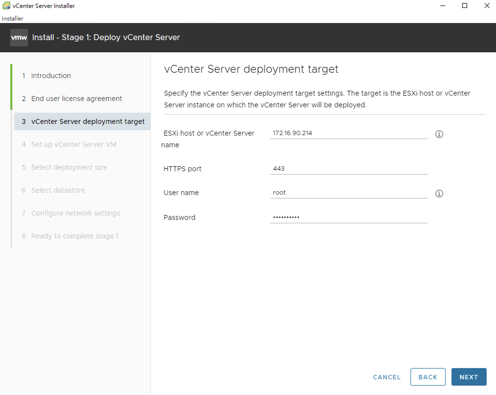

   

   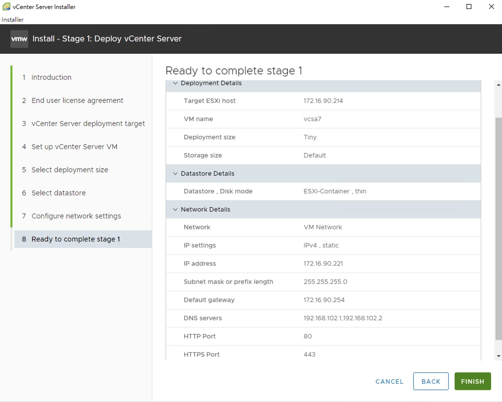

   

   

   

   
   

5. vCenter Setting

   - 先在vCenter Create Datacenter並新增Nutanix Cluster
     Cluster **開啟DRS、HA**

   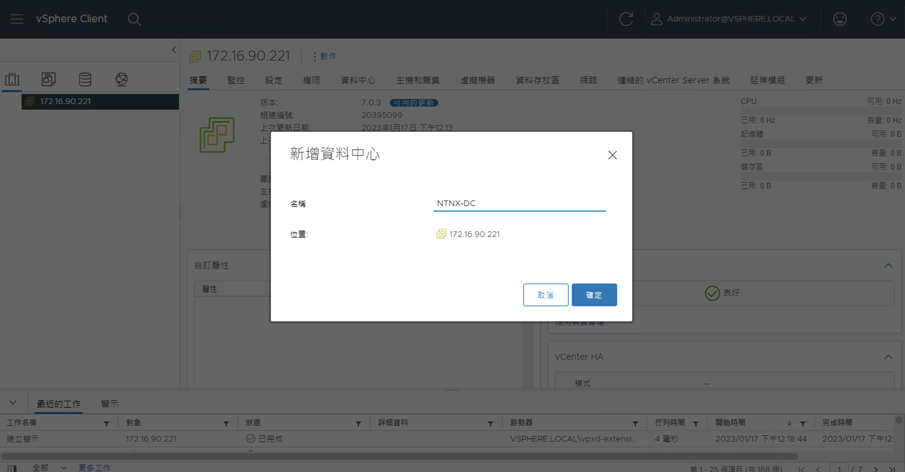

   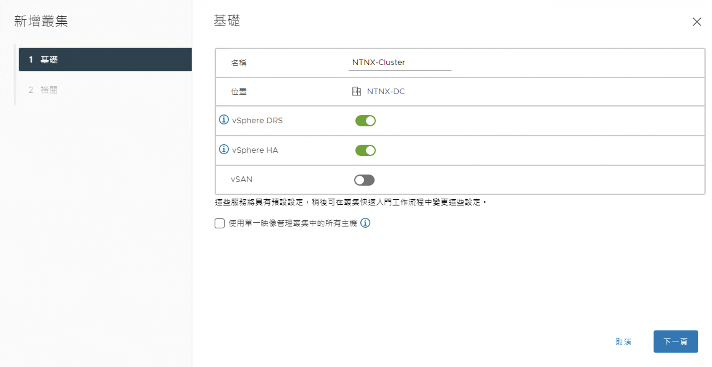

6. **確認Checklist都有設定完畢才能加入Nutanix Node**
   HA

   - Enable Host Monitoring

   - Set the Host Isolation Response of the cluster to **Power Off & Restart VMs**.
     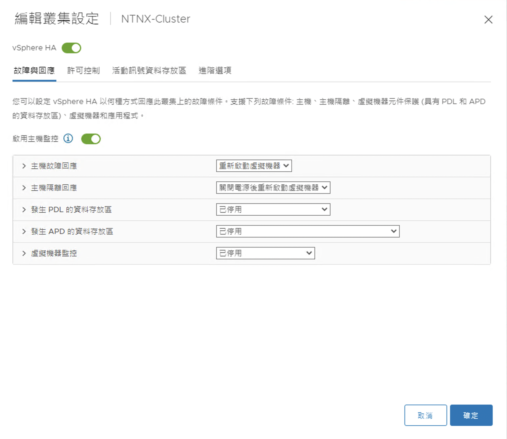

   - Enable admission control (%)

     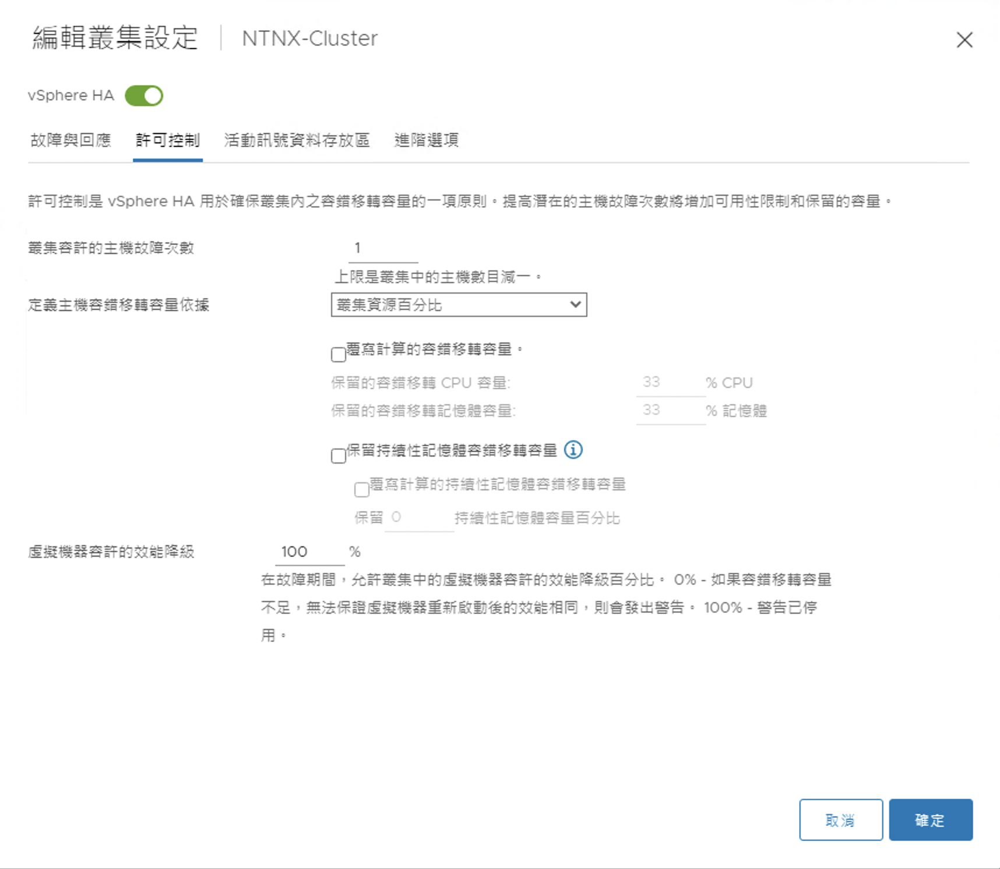

   - Set the VM Restart Priority of all CVMs to **Disabled**. -- After register
     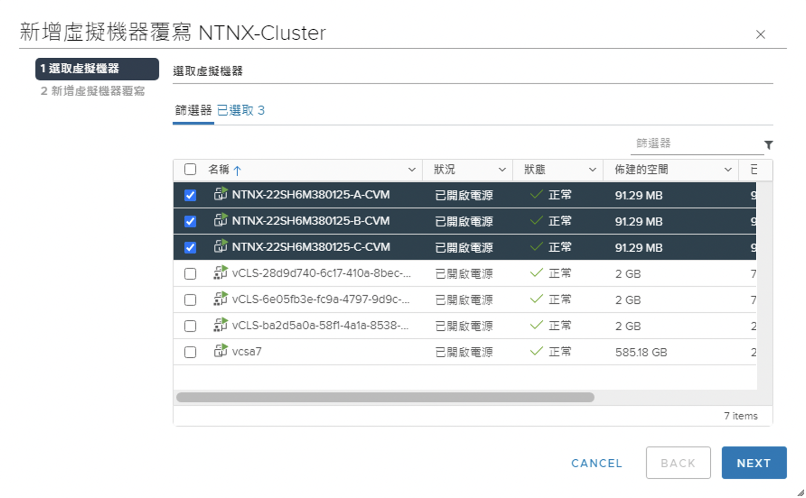

     

   - Set the VM Monitoring for all CVMs to **Disabled**. -- After register

     

   - Datastore heartbeats -- After register 

     (只有一個Datastore時,增加此設定)
     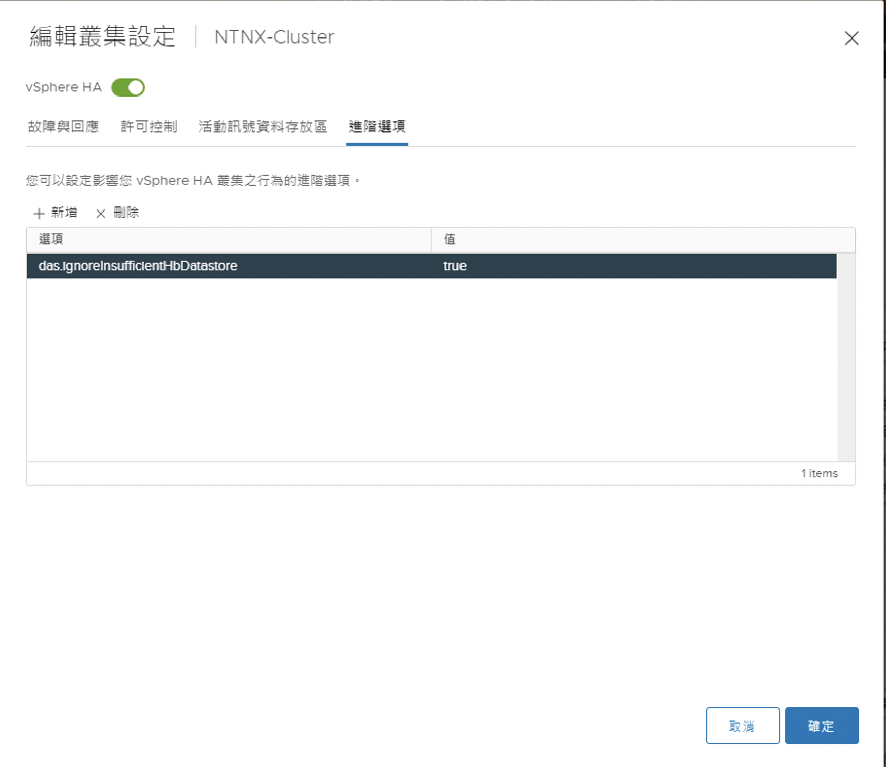

     

   DRS

   - Set the Automation Level on all CVMs to **Disabled**. --After register
     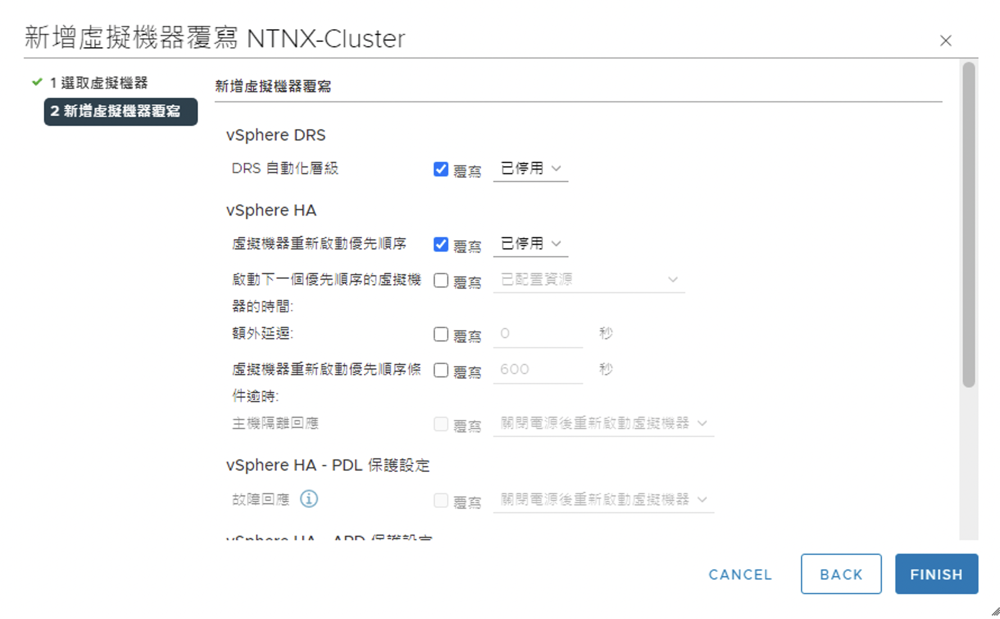

   - Select Automation Level to accept level 3 recommendations.

     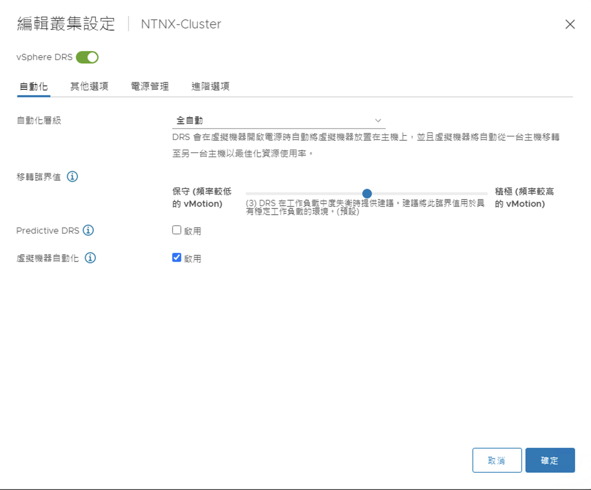

   - Leave power management **disabled**.
     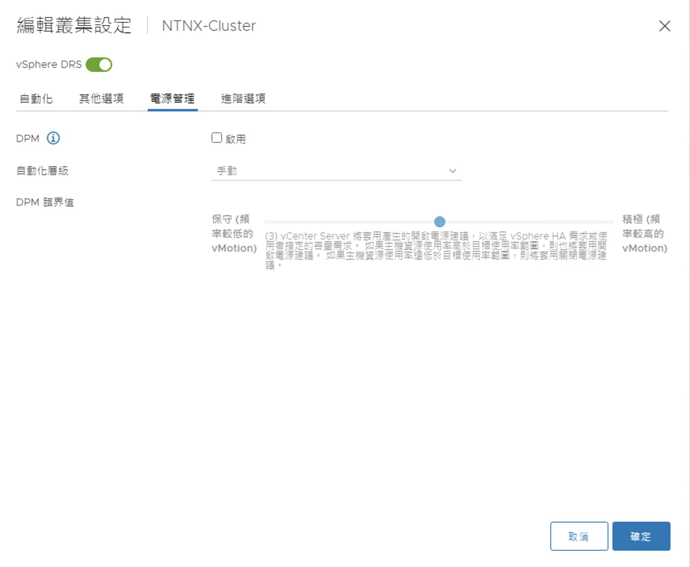

   Others

   - Configure advertised capacity for the Nutanix storage container (RF2)
     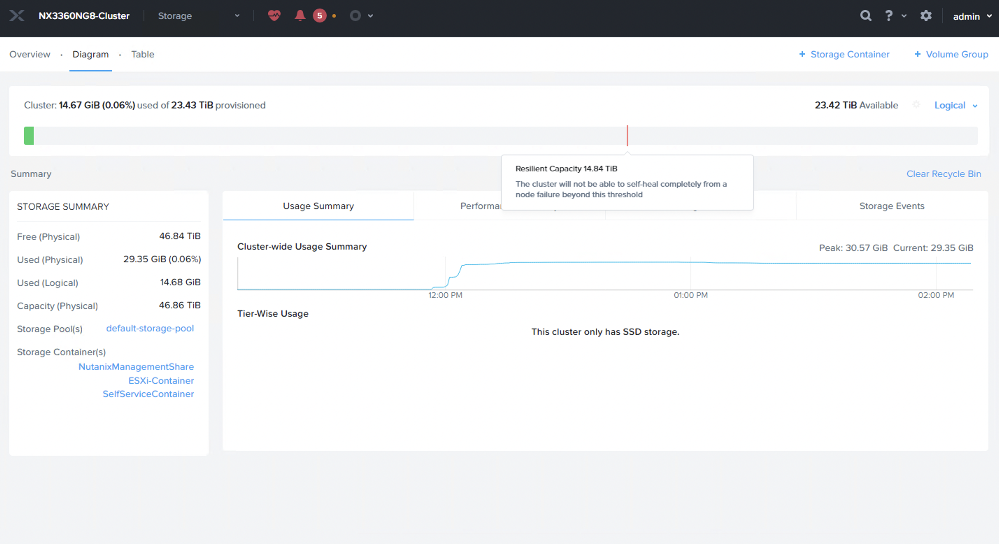 

   - Store VM swapfiles in the same directory as the VM.

     
     https://docs.vmware.com/en/VMware-vSphere/7.0/com.vmware.vsphere.resmgmt.doc/GUID-12B8E0FB-CD43-4972-AC2C-4B4E2955A5DA.html

   - **Enable** enhanced vMotion compatibility (EVC) in the cluster.
     

   - Configure Nutanix CVMs with the appropriate VM overrides. --After register
     (HA、DRS、Monitoring **Disabled**)

7. vCenter Adding Nutanix nodes

   

   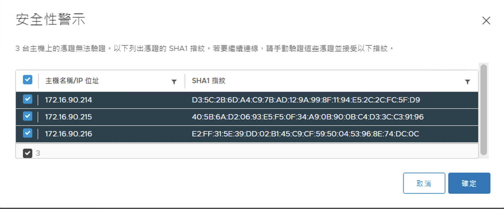

   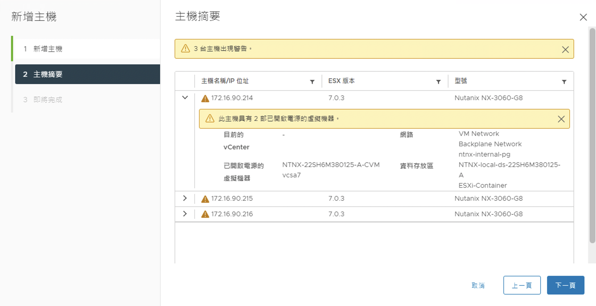

   

   實測第一台Node會被順利加到Cluster內,其他兩台需手動移入
   

8. 補齊Checklist的設定

9. Register Nutanix Cluster to vCenter
   

   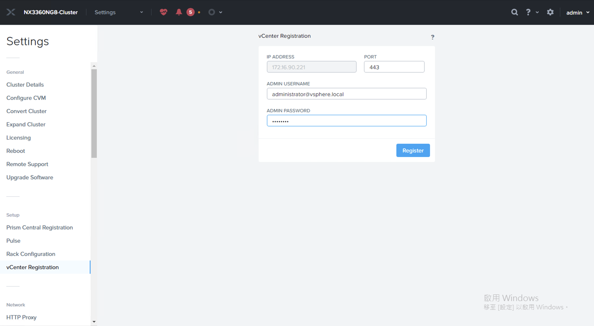

   

## 安裝後的設定-PC

https://portal.nutanix.com/page/documents/details?targetId=Acropolis-Upgrade-Guide:upg-vm-install-wc-r.html

1. create PC
   

   

   
   

2. 123

3. 123

4. 123

# vSphere Settings Checklist

https://portal.nutanix.com/page/documents/details?targetId=vSphere-Admin6-AOS-v6_5:vsp-vcenter-settings-r.html

Review the following checklist of the settings that you have to configure to successfully deploy vSphere virtual environment running Nutanix Enterprise cloud.

## vSphere Availability Settings

- **Enable** host monitoring.

- **Enable** admission control and use the percentage-based policy with a value based on the number of nodes in the cluster.

  For more information about settings of percentage of cluster resources reserved as failover spare capacity, [vSphere HA Admission Control Settings for Nutanix Environment](https://portal.nutanix.com/page/documents/details?targetId=vSphere-Admin6-AOS-v6_5:vsp-cluster-settings-admissioncontrol-vcenter-vsphere-r.html).

- Set the VM Restart Priority of all CVMs to **Disabled**.

- Set the Host Isolation Response of the cluster to **Power Off & Restart VMs**.

- Set the VM Monitoring for all CVMs to **Disabled**.

- Enable datastore heartbeats by clicking **Use datastores only from the specified list** and choosing the Nutanix NFS datastore.

  If the cluster has only one datastore, click **Advanced Options** tab and add das.ignoreInsufficientHbDatastore with **Value** of true.

## vSphere DRS Settings

- Set the Automation Level on all CVMs to **Disabled**.
- Select Automation Level to accept level 3 recommendations.
- Leave power management **disabled**.

## Other Cluster Settings

- Configure advertised capacity for the Nutanix storage container 
  (total usable capacity minus the capacity of one node for replication factor 2 or two nodes for replication factor 3).
- Store VM swapfiles in the same directory as the VM.
- **Enable** enhanced vMotion compatibility (EVC) in the cluster. For more information, see [vSphere EVC Settings](https://portal.nutanix.com/page/documents/details?targetId=vSphere-Admin6-AOS-v6_5:vsp-cluster-settings-evc-vcenter-vsphere-t.html).
- Configure Nutanix CVMs with the appropriate VM overrides. For more information, see [VM Override Settings](https://portal.nutanix.com/page/documents/details?targetId=vSphere-Admin6-AOS-v6_5:vsp-cluster-settings-override-vcenter-vsphere-t.html).
- Check [Nonconfigurable ESXi Components](https://portal.nutanix.com/page/documents/details?targetId=vSphere-Admin6-AOS-v6_5:vsp-node-components-unconfigurable-vsphere-r.html). Modifying the nonconfigurable components may inadvertently constrain performance of your Nutanix cluster or render the Nutanix cluster inoperable.

